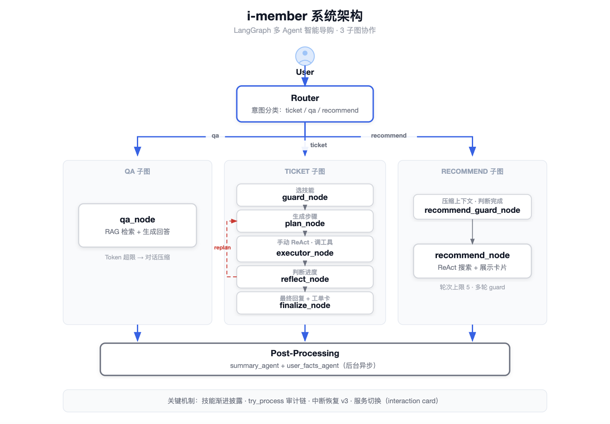
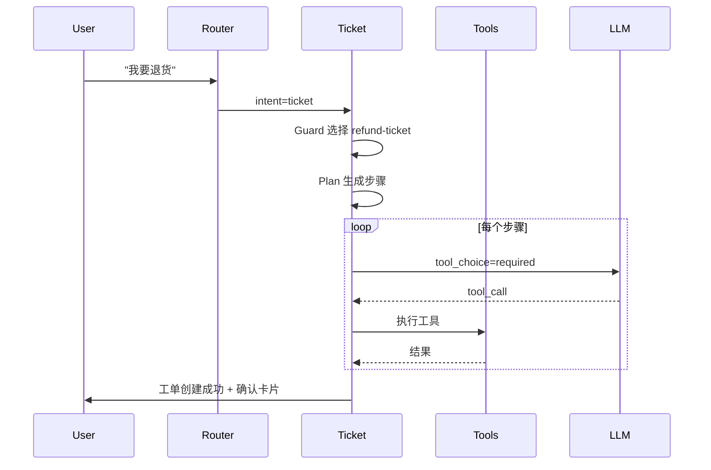
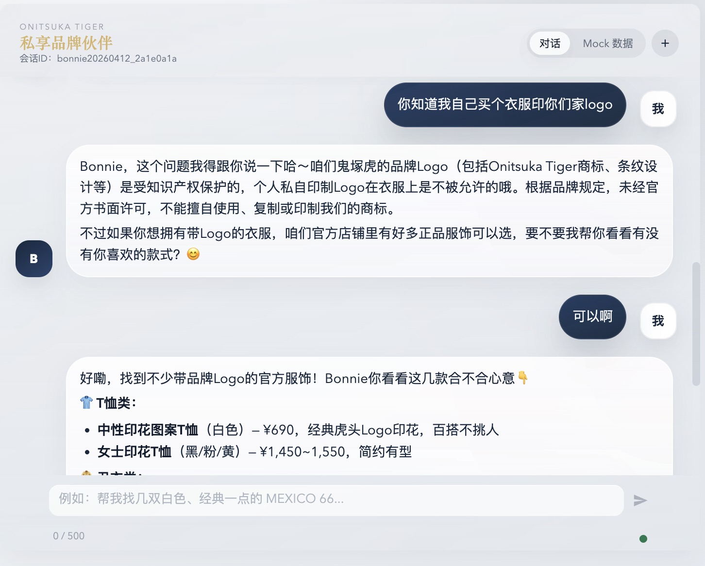
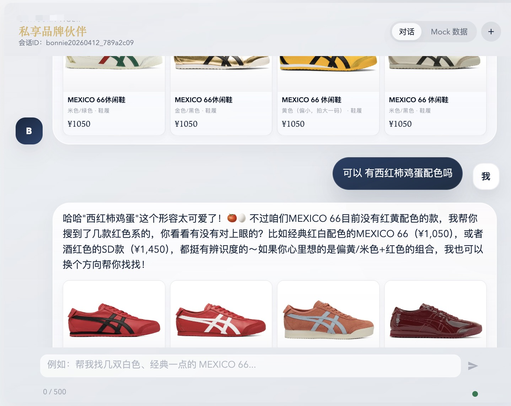
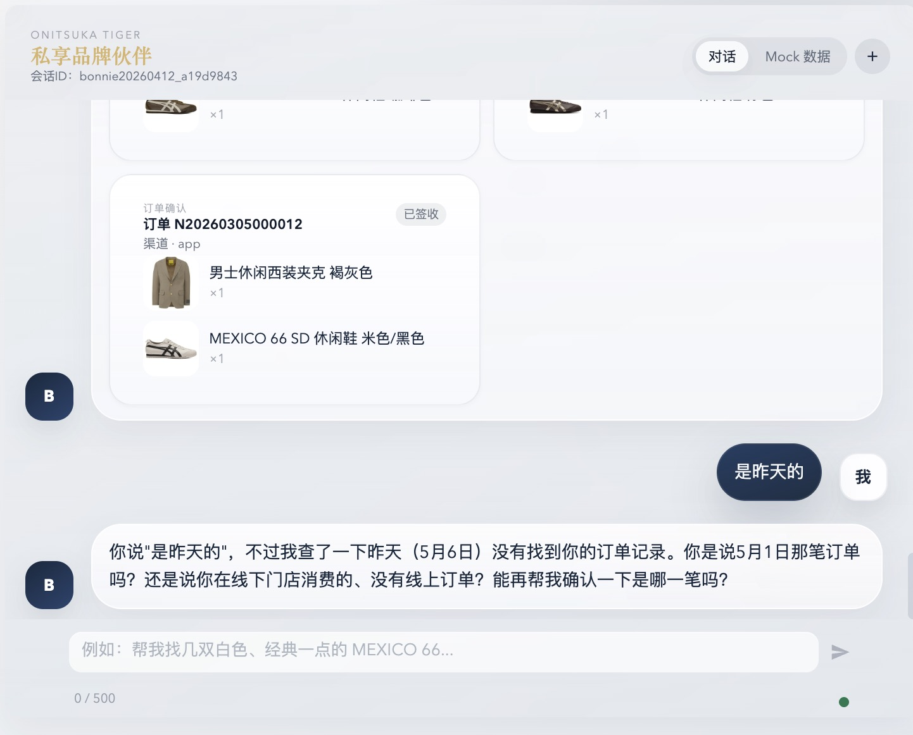
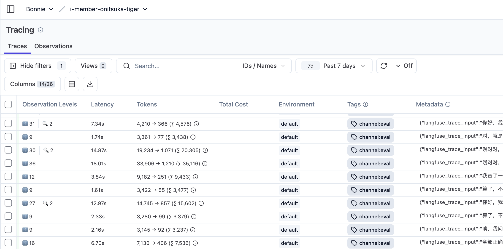
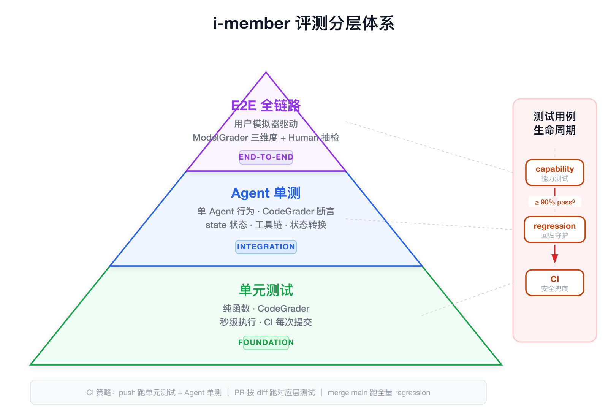

> ⚠️ **免责声明**：本项目仅为个人学习与技术验证用途，不构成任何商业产品。详见 [DISCLAIMER.md](./docs/DISCLAIMER.md)。

# i-member · 多 Agent 智能品牌伙伴

基于 LangGraph 的多 Agent 智能品牌助手。以 Skill + Tools 抽象实现品牌可插拔，所有状态通过 Redis checkpoint 持久化，支持中断恢复。

## 当前版本

**Milestone 1: 核心在线服务能力落地** — Router、QA、Ticket、Recommend、Post Process 核心链路和评测体系构建完成。

## 架构

系统由一个主路由和三个业务子图组成，基于 LangGraph 构建，状态通过 Redis checkpoint 持久化。



**Router**：基于 LLM 结构化输出的意图路由，单次调用完成分类与分发。

**Ticket 子图**：Plan-and-Execute 多 Agent 协作。Guard → Plan → Executor → Reflect → Finalize 五节点流水线，内建失败重规划（replan）和人工介入中断恢复（interrupt/resume），工具按步骤动态绑定、按剩余次数裁剪。



**QA 子图**：ReAct Agent 挂载 RAG 检索（Qdrant），上下文中自动注入用户画像与服务记忆，token 超阈值触发对话压缩。

**Recommend 子图**：Guard + Agent 两阶段。Guard 负责跨轮上下文摘要与锚点商品抽取，Agent 负责工具调用与商品收敛。

## 快速开始

```bash
git clone https://github.com/bonnie2015/i-member.git && cd i-member
cp .env.example .env  # 必填 DEEPSEEK_API_KEY
docker compose up -d
# 打开 http://localhost:3000
```

> **LLM 依赖**：使用 DeepSeek API。Ollama 不配置时自动走 remote。

### 开发模式

```bash
docker compose --profile dev up -d   # backend 热重载
```

## 效果展示







[更多推荐表现](https://github.com/bonnie2015/i-member/issues/9#issuecomment-4405059807)、[更多工单表现](https://github.com/bonnie2015/i-member/issues/3#issuecomment-4405109262)、[更多咨询表现](https://github.com/bonnie2015/i-member/issues/11#issuecomment-4405130128)

## 核心工程

系统围绕多 Agent 协作的可靠性展开：手写 ReAct 循环实现精确的工具调用控制和中断恢复，按子图差异化压缩策略控制上下文规模，三层正交记忆支撑跨会话个性化，工具按步骤动态绑定并在接近上限时裁剪。评测体系覆盖单元到全链路的验证，生产环境具备分布式锁、双级限流和超时降级保障。

> 详见 [系统设计](https://github.com/bonnie2015/i-member/issues/22)

## Benchmark

测试环境：DeepSeek Chat，Docker Compose 本地部署，单并发。

| 指标 | 优化前 | 优化后 |
|------|--------|--------|
| 平均单轮 Token | 25k | 6.4k（-75%） |
| P95 响应延迟 | 27s | 5s（~5x） |

当前稳态指标：

| 场景 | 单轮 token | 响应时间 | 压缩比 |
|------|-----------|---------|--------|
| Ticket 工单 | 2.7k-4.8k | 2-6s | — |
| Recommend 推荐 | ~3.5k | 5-8s | — |
| QA 咨询 | — | 5-7s | ~43% |



## 评测体系



| 层级 | 规模 | 方法 |
|------|------|------|
| 单元测试 | 6 模块 | 纯函数断言，秒级 |
| Agent 单测 | 37 case | CodeGrader 检查工具链与状态转换 |
| E2E 全链路 | 18 case | User Simulator 驱动 + ModelGrader 三维评分 |

新增用例先在开发环境验证，稳定后纳入 CI 作为回归门禁。

```bash
docker compose exec backend python -m pytest tests/unit/ -v         # 单元测试
docker compose exec backend python -m pytest tests/eval/agent/ -v   # Agent 单测
docker compose exec backend python -m pytest tests/eval/e2e/ -v     # E2E
```

## 品牌接入指南

> ⚠️ 接入灵活度目前处于 **Beta 阶段**。建议基于 [imember-v1](https://github.com/bonnie2015/i-member/tree/imember-v1) 分支进行品牌接入，该分支为本项目的脱敏骨架版本。

**1. 品牌提示词**（`app/prompts/prompt_prefix.txt`）

品牌人设模板，填充品牌名、语气、经营范围即可。一个文件，所有 prompt 自动继承前缀。

**2. 技能文件**（`app/skills/ticket/{skill-name}/SKILL.md`）

按业务场景编写。每个 SKILL.md 包含：
- `name` / `description` / `available_tools` / `clarify_labels`（YAML frontmatter）
- 核心定位、受理条件、处理原则、场景细分、工具使用时机（Markdown body）

**3. 工具准备**（`app/tools/business/`）

所有业务工具统一通过 `get_scrm_tools()` 返回给框架。品牌接入只需实现工具函数并注册到该方法中。

**必须实现**（框架硬引用，缺失则系统启动报错）：

| 工具名 | 说明 |
|--------|------|
| `search_products` | 商品搜索，Recommend Agent 直接调用 |
| `get_product_detail` | 商品详情查询，Plan / Recommend Agent 直接调用 |

**按需实现**（取决于启用的 Skill，Skill YAML 中声明即需要）：

当前 Skill 已引用的工具：`get_user_orders`、`get_order_detail`、`create_ticket`、`get_ticket`、`get_tickets`。不启用对应 Skill 则无需实现。

每个工具的标准结构：`@tool` 装饰器 + Pydantic Field 输入 schema + API 调用归一化为 JSON。

工具的 `description` 和参数的 `Field(description=...)` 直接影响 LLM 调用准确率——Agent 根据这些描述判断何时调用、传什么参数。描述应明确工具的使用指南。参考 `app/tools/business/scrm_tools.py` 中的现有实现。

**4. RAG**（`data/brand_docs/`）

QA 模块通过 RAG 检索品牌知识库回答问题。

> 仓库中提供了一个基于 Qdrant + LlamaParse 的快速启动实现，仅用于本地演示。快速验证步骤：
> 1. 将品牌文档放入 `data/brand_docs/`
> 2. 配置 `LLAMA_CLOUD_API_KEY`，运行 `docker compose exec backend python -m app.rag.ingest`

品牌接入时需自行实现检索逻辑，替换 `rag_tools.py`：

1. 实现 `rag_search` 工具（框架硬引用，QA Agent 直接调用）
2. 实现 `size_guide_search` 工具（可选）
3. 检索策略（向量库选型、embedding 模型、chunk 策略、top_k、混合检索等）自行决定
