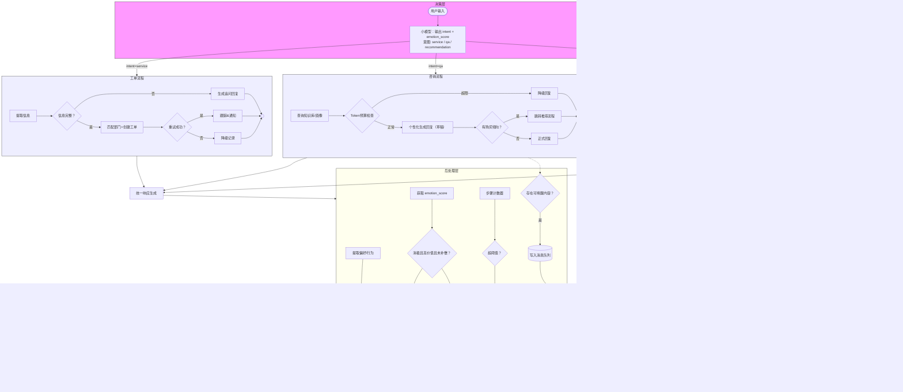
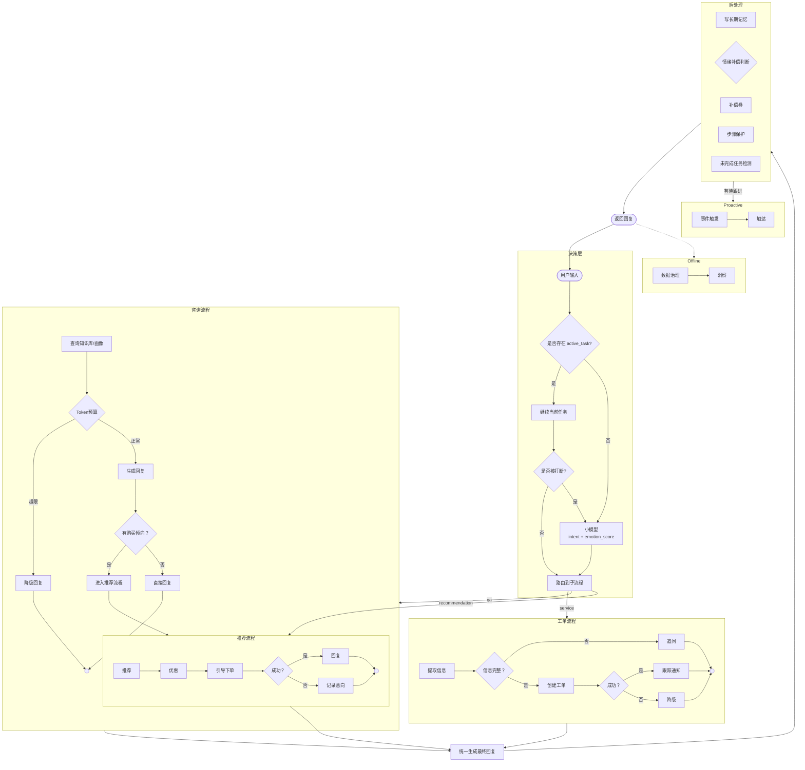
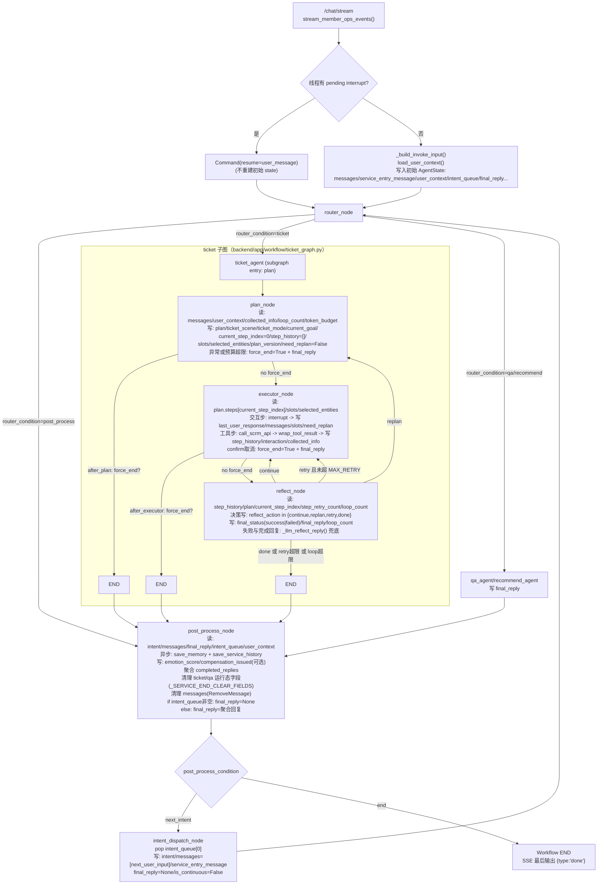

```mermaid
graph TD
    %% =========================
    %% ① 决策层：小模型直接输出意图+情绪评分，并路由
    %% =========================
    subgraph Decision [决策层]
        Start([用户输入]) --> Router[小模型：输出 intent + emotion_score<br/>意图: service / qa / recommendation]
    end

    %% 根据意图直接路由到执行块
    Router -->|intent=service| ServiceBlock
    Router -->|intent=qa| QaBlock
    Router -->|intent=recommendation| RecBlock

    %% =========================
    %% ② 执行层（三大独立块）
    %% =========================

    subgraph ServiceBlock [工单流程]
        S1[提取信息] --> S2{信息完整？}
        S2 -->|否| S3[生成追问回复] --> S_End
        S2 -->|是| S4[匹配部门+创建工单] --> S5{重试成功？}
        S5 -->|是| S6[跟踪&通知] --> S_End
        S5 -->|否| S7[降级记录] --> S_End
        S_End(( ))
    end

    subgraph QaBlock [咨询流程]
        Q1[查询知识库/画像] --> Q2{Token预算检查}
        Q2 -->|超限| Q3[降级回复] --> Q_End
        Q2 -->|正常| Q4[个性化生成回复（草稿）] --> Q5{有购买倾向？}
        Q5 -->|是| Q6[跳转推荐流程] --> Q_End
        Q5 -->|否| Q7[正式回复] --> Q_End
        Q_End(( ))
    end

    subgraph RecBlock [推荐与购买流程]
        R1[个性化推荐] --> R2[优惠提醒]
        R2 --> R3[引导预约/试穿]
        R3 --> R4[引导下单] --> R5{自愈重试}
        R5 -->|成功| R6[生成回复] --> R_End
        R5 -->|失败| R7[记录意向] --> R_End
        R_End(( ))
    end

    %% =========================
    %% ③ 汇总层
    %% =========================
    ServiceBlock --> Merge[统一响应生成]
    QaBlock --> Merge
    RecBlock --> Merge

    %% =========================
    %% ④ 后处理层（情绪评分通过状态隐式传递）
    %% =========================
    subgraph Post [后处理层]
        direction TB
        P1[提取偏好/行为] --> P2[(写入长期记忆 Milvus)]
        P3[获取 emotion_score] --> P4{消极且高价值且未补偿？}
        P4 -->|是| P5[发送补偿券+标记]
        P4 -->|否| P6[无动作]
        P7[步骤计数器] --> P8{超阈值？} -->|是| P9[中断告警]
        P10{存在可唤醒内容？} -->|是| P11[(写入消息队列)]
    end

    Merge --> Post
    Post --> End([返回回复])

    %% 可唤醒内容检测来自咨询块
    QaBlock -.-> P10

    %% =========================
    %% ⑤ 主动触达引擎
    %% =========================
    subgraph Proactive [主动触达引擎]
        A1[行为事件] --> A3[触达决策]
        A2[定时任务] --> A3
        A3 --> A4[跨渠道推送]
    end

    P11 --> Proactive

    %% =========================
    %% ⑥ 离线系统
    %% =========================
    subgraph Offline [离线数据系统]
        O1[数据治理] --> O2[洞察分析]
    end

    End -.-> Offline

    style Decision fill:#f9f,stroke:#333
    style ServiceBlock fill:#eef,stroke:#333
    style QaBlock fill:#eef,stroke:#333
    style RecBlock fill:#eef,stroke:#333
    style Post fill:#ffe,stroke:#333
    style Proactive fill:#ccf,stroke:#333
    style Offline fill:#cfc,stroke:#333
```

```mermaid
    graph TD

    %% =========================
    %% ① 决策层（带任务判断）
    %% =========================
    subgraph Decision [决策层]
        Start([用户输入])

        Start --> TaskCheck{是否存在 active_task?}

        TaskCheck -->|是| ContinueTask[继续当前任务]
        TaskCheck -->|否| Router

        Router[小模型<br/>intent + emotion_score]

        ContinueTask --> Interrupt{是否被打断?}
        Interrupt -->|否| RouteTask
        Interrupt -->|是| Router

        Router --> RouteTask[路由到子流程]
    end

    %% =========================
    %% ② 执行层（三大流程）
    %% =========================

    subgraph ServiceBlock [工单流程]
        S1[提取信息] --> S2{信息完整？}
        S2 -->|否| S3[追问] --> S_End
        S2 -->|是| S4[创建工单] --> S5{成功？}
        S5 -->|是| S6[跟踪通知] --> S_End
        S5 -->|否| S7[降级] --> S_End
        S_End(( ))
    end

    subgraph QaBlock [咨询流程]
        Q1[查询知识库/画像] --> Q2{Token预算}
        Q2 -->|超限| Q3[降级回复] --> Q_End
        Q2 -->|正常| Q4[生成回复] --> Q5{有购买倾向？}
        Q5 -->|是| Q6[进入推荐流程]
        Q5 -->|否| Q7[直接回复]
        Q6 --> RecBlock
        Q7 --> Q_End
        Q_End(( ))
    end

    subgraph RecBlock [推荐流程]
        R1[推荐] --> R2[优惠]
        R2 --> R3[引导下单] --> R4{成功？}
        R4 -->|是| R5[回复] --> R_End
        R4 -->|否| R6[记录意向] --> R_End
        R_End(( ))
    end

    %% 路由
    RouteTask -->|service| ServiceBlock
    RouteTask -->|qa| QaBlock
    RouteTask -->|recommendation| RecBlock

    %% =========================
    %% ③ 汇总层
    %% =========================
    ServiceBlock --> Merge
    QaBlock --> Merge
    RecBlock --> Merge

    Merge[统一生成最终回复]

    %% =========================
    %% ④ 后处理层
    %% =========================
    subgraph Post [后处理]
        P1[写长期记忆]
        P2{情绪补偿判断}
        P3[补偿券]
        P4[步骤保护]
        P5[未完成任务检测]
    end

    Merge --> Post

    %% =========================
    %% ⑤ 循环（关键！）
    %% =========================
    Post --> End([返回回复])
    End --> Start

    %% =========================
    %% ⑥ 主动触达
    %% =========================
    subgraph Proactive
        A1[事件触发] --> A2[触达]
    end

    Post -->|有待跟进| Proactive

    %% =========================
    %% ⑦ 离线系统
    %% =========================
    subgraph Offline
        O1[数据治理] --> O2[洞察]
    end

    End -.-> Offline
```

```mermaid
flowchart TD
    A["/chat/stream\nstream_member_ops_events()"] --> B{"线程有 pending interrupt?"}
    B -- "是" --> C["Command(resume=user_message)\n(不重建初始 state)"]
    B -- "否" --> D["_build_invoke_input()\nload_user_context()\n写入初始 AgentState:\nmessages/service_entry_message/user_context/intent_queue/final_reply..."]

    C --> E["router_node"]
    D --> E

    E -->|router_condition=post_process| P["post_process_node"]
    E -->|router_condition=ticket| T0["ticket_agent (subgraph entry: plan)"]
    E -->|router_condition=qa/recommend| Q["qa_agent/recommend_agent\n写 final_reply"] --> P

    subgraph TICKET["ticket 子图（backend/app/workflow/ticket_graph.py）"]
      T0 --> T1["plan_node\n读: messages/user_context/collected_info/loop_count/token_budget\n写: plan/ticket_scene/ticket_mode/current_goal/\ncurrent_step_index=0/step_history=[]/\nslots/selected_entities/plan_version/need_replan=False\n异常或预算超限: force_end=True + final_reply"]
      T1 -->|after_plan: force_end? | TEND1["END"]
      T1 -->|no force_end| T2["executor_node\n读: plan.steps[current_step_index]/slots/selected_entities\n交互步: interrupt -> 写 last_user_response/messages/slots/need_replan\n工具步: call_scrm_api -> wrap_tool_result -> 写 step_history/interaction/collected_info\nconfirm取消: force_end=True + final_reply"]
      T2 -->|after_executor: force_end?| TEND2["END"]
      T2 -->|no force_end| T3["reflect_node\n读: step_history/plan/current_step_index/step_retry_count/loop_count\n决策写: reflect_action in {continue,replan,retry,done}\n写: final_status(success|failed)/final_reply/loop_count\n失败与完成回复: _llm_reflect_reply() 兜底"]
      T3 -->|continue| T2
      T3 -->|replan| T1
      T3 -->|retry 且未超 MAX_RETRY| T2
      T3 -->|done 或 retry超限 或 loop超限| TEND3["END"]
    end

    TEND1 --> P
    TEND2 --> P
    TEND3 --> P

    P["post_process_node\n读: intent/messages/final_reply/intent_queue/user_context\n异步: save_memory + save_service_history\n写: emotion_score/compensation_issued(可选)\n聚合 completed_replies\n清理 ticket/qa 运行态字段(_SERVICE_END_CLEAR_FIELDS)\n清理 messages(RemoveMessage)\nif intent_queue非空: final_reply=None\nelse: final_reply=聚合回复"] --> R{"post_process_condition"}

    R -- "next_intent" --> S["intent_dispatch_node\npop intent_queue[0]\n写: intent/messages=[next_user_input]/service_entry_message\nfinal_reply=None/is_continuous=False"] --> E
    R -- "end" --> Z["Workflow END\nSSE 最后输出 {type:'done'}"]

```
