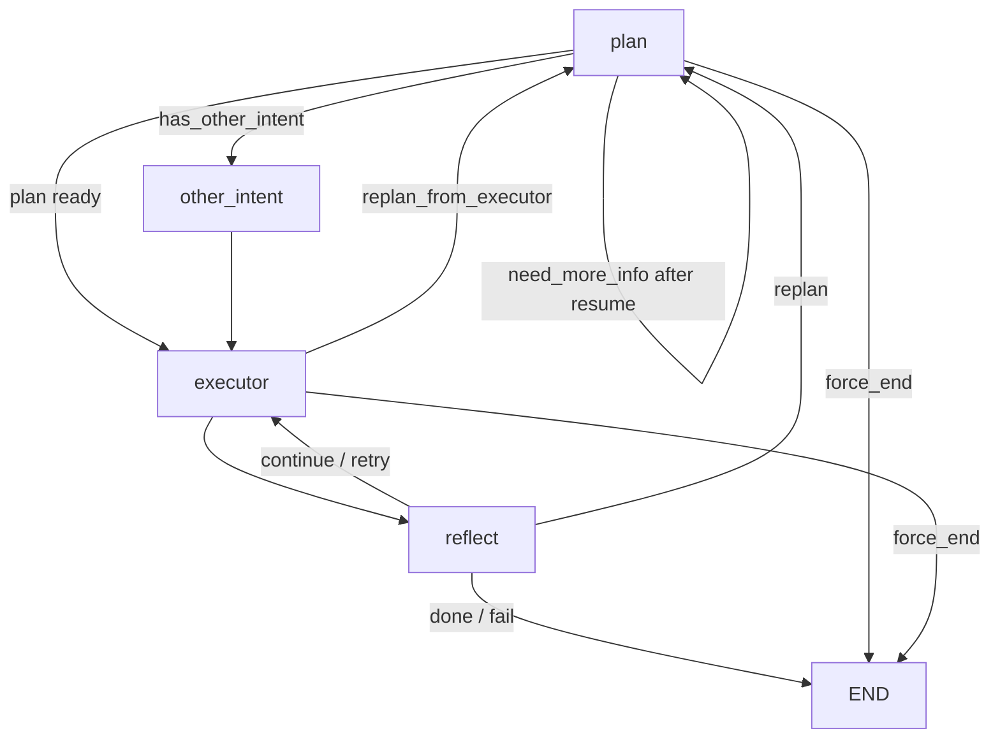

# ticket 子图设计说明（整合版）

## 1. 文档目标

本文基于当前代码实现，梳理 `ticket` 子图已经覆盖的功能设计，并对比历史 `ticket_agent` 单节点实现，输出一份面向后续迭代的整合设计说明。

设计原则只有一条优先级最高：

- `ticket` 子图的 workflow 尽量保持最小改动。
- 如非必要，不新增过多 node。
- 追问、确认、恢复、重规划优先复用现有节点内的 `interrupt` 机制完成。

---

## 2. 当前 ticket 子图覆盖的功能设计

当前 `ticket` 服务已从单节点 agent 演进为 LangGraph 子图，入口挂载在父图 [backend/app/workflow/graph.py](/Users/xyg/就业/AI/Agent/i-member/backend/app/workflow/graph.py) 的 `ticket_agent` 节点，子图定义位于 [backend/app/workflow/ticket_graph.py](/Users/xyg/就业/AI/Agent/i-member/backend/app/workflow/ticket_graph.py)。

### 2.1 覆盖的业务范围

当前 prompt 和 state 已明确支持以下工单类型：

- `refund`：退货
- `change`：换货
- `quality`：质量/破损问题
- `complain`：投诉
- `equity`：权益申请

其中计划生成依赖 [backend/app/prompts/ticket_plan.txt](/Users/xyg/就业/AI/Agent/i-member/backend/app/prompts/ticket_plan.txt)，实际可调用工具由 [backend/app/tools/scrm_tools.py](/Users/xyg/就业/AI/Agent/i-member/backend/app/tools/scrm_tools.py) 统一管理。

### 2.2 当前已经落地的核心能力

#### 1）工单目标识别与步骤规划

`plan_node` 位于 [backend/app/workflow/node/ticket_planner.py](/Users/xyg/就业/AI/Agent/i-member/backend/app/workflow/node/ticket_planner.py)。

已覆盖能力：

- 结合 `messages`、`collected_info`、`user_context`、skills 快照生成结构化计划。
- 输出 `target / steps / need_more_info / has_other_intent` 等字段。
- 支持多工单诉求统一纳入一个 plan 中规划执行步骤。
- 明确区分 `required` 和 `optional` 追问项。
- 优先要求模型“先查工具，再追问用户”，减少无意义追问。

#### 2）追问与中断恢复

当前没有单独的 `clarify` 节点，追问直接内嵌在 `plan_node` 内通过 `interrupt(...)` 完成。

已覆盖能力：

- 缺少关键信息时直接中断并向前端抛出问题。
- 用户恢复输入后，父图通过 `Command(resume=...)` 回到中断点继续执行。
- 恢复后通过 `pending_replan=True` 强制回到 `plan` 重新评估，而不是沿用旧计划硬执行。
- 追问上限由 `MAX_CLARIFY=3` 控制，避免无限追问。
- 追问失败后不继续机械循环，而是生成“暂停等待补充信息”的收口回复。

这部分是当前子图比旧 `ticket_agent` 更稳定的关键改动。

#### 3）订单/商品选择类交互

子图已支持将部分追问转换为结构化交互卡片，而不只是纯文本追问。

已覆盖能力：

- 多商品订单时，先让用户选择具体商品，再继续写操作。
- 订单、商品、工单等查询结果可转换为统一 `interaction` 协议。
- 前端可基于 `select_order / select_product / select_ticket / confirm_ticket` 等类型渲染交互。

协议定义位于：

- [backend/app/workflow/graph.py](/Users/xyg/就业/AI/Agent/i-member/backend/app/workflow/graph.py)
- [backend/app/api/v1/models/chat.py](/Users/xyg/就业/AI/Agent/i-member/backend/app/api/v1/models/chat.py)

#### 4）执行前确认

`executor_node` 位于 [backend/app/workflow/node/ticket_executor.py](/Users/xyg/就业/AI/Agent/i-member/backend/app/workflow/node/ticket_executor.py)。

已覆盖能力：

- 对 `create_ticket / upgrade_membership / issue_compensation_coupon` 等写操作执行前确认。
- 确认动作同样通过 `interrupt` 完成，不新增确认节点。
- 用户确认后写入 `user_confirmed=True`，防止 replan 后重复确认。
- 用户取消时直接结束本轮服务。
- 用户回复既不是确认也不是取消时，回退到 `plan` 重新理解用户真实意图。

#### 5）单步执行 + 结果沉淀

当前 executor 是“按 step 单步执行”，而不是一次性跑完整个计划。

已覆盖能力：

- 每次只执行 `current_step` 对应的一个 tool。
- 将结果写入 `execution_results`，供 reflect 和后续节点使用。
- 根据工具类型自动生成交互信息，透传给前端。
- `get_order_detail` 的结果会被转写为 `collected_info.order_items`，供后续 replan/商品选择复用。

#### 6）反思与动态流转

`reflect_node` 位于 [backend/app/workflow/node/ticket_reflect.py](/Users/xyg/就业/AI/Agent/i-member/backend/app/workflow/node/ticket_reflect.py)。

已覆盖能力：

- 每执行一步都做一次 reflect，而不是等所有 step 执行完再统一总结。
- 支持 `continue / replan / retry / done / fail` 五类决策。
- 对失败重试和全局循环均设置上限，避免图无限循环。
- `done/fail` 时生成自然语言回复。
- 当用户情绪明显负面时，最终回复自动补上更自然的安抚前缀。

#### 7）其他意图并行识别

`other_intent_node` 位于 [backend/app/workflow/node/ticket_other_intent.py](/Users/xyg/就业/AI/Agent/i-member/backend/app/workflow/node/ticket_other_intent.py)。

已覆盖能力：

- 当 plan 识别出消息中同时包含非工单诉求时，不打断当前 ticket 主流程。
- 调用 `recognize_intent` 识别其他意图，并写入 `intent_queue`。
- 为后续跨服务衔接预留队列，不强耦合在 ticket 子图内部完成。

#### 8）上下文、记忆、连续服务承接

当前 ticket 子图并非只看当前一句消息，还会使用父图预加载的用户上下文。

已覆盖能力：

- 使用 `user_context` 中的 profile、长期记忆、最近服务。
- 对连续服务场景，ticket prompt 会注入最近一轮服务上下文。
- 识别负面情绪时，在追问和收口回复中调整语气。

这部分主要依赖：

- [backend/app/service/user_context.py](/Users/xyg/就业/AI/Agent/i-member/backend/app/service/user_context.py)
- [backend/app/service/emotion_service.py](/Users/xyg/就业/AI/Agent/i-member/backend/app/service/emotion_service.py)

#### 9）流程可观测性

## 3. 当前 ticket 子图 workflow

当前节点结构非常克制，总共 4 个节点：

1. `plan`
2. `other_intent`
3. `executor`
4. `reflect`

主流程如下：

### 3.1 为什么当前结构合理

这个结构的优势在于：

- 追问不拆节点，恢复点天然准确。
- 确认不拆节点，写操作语义集中在 executor。
- reflect 独立存在，便于控制 `continue/replan/retry/done/fail`。
- `other_intent` 作为辅助节点存在价值明确，且边界清晰。

因此后续优化建议继续维持 4 节点结构，不建议再拆出：

- `clarify_node`
- `confirm_node`
- `tool_router_node`
- `result_parser_node`

除非后续出现明确的复杂度证据，否则这些拆分只会增加状态同步和恢复成本。

---

## 4. 关键状态设计

核心状态定义位于 [backend/app/workflow/state.py](/Users/xyg/就业/AI/Agent/i-member/backend/app/workflow/state.py)。

### 4.1 通用服务态

- `messages`：当前服务内消息
- `intent / reason`：本轮服务路由结果
- `is_continuous`：是否承接上一轮服务
- `user_context`：用户画像、记忆、最近服务
- `interaction`：最近一次交互卡片信息
- `token_usage_total`：本轮 token 累计

### 4.2 ticket 子图专用态

- `plan`：当前结构化计划
- `current_step`：当前执行到第几步
- `execution_results`：已执行步骤结果
- `collected_info`：过程中收集到的上下文信息
- `clarify_count`：追问次数
- `retry_count`：当前步骤重试次数
- `loop_count`：整个 ticket 循环次数
- `reflect_action`：最近一次反思结果
- `user_confirmed`：写操作是否已经确认
- `pending_replan`：追问恢复后是否必须回到 plan
- `replan_from_executor`：executor 是否要求回到 plan
- `has_other_intent`：是否识别到非工单意图
- `force_end`：是否需要强制收口

### 4.3 状态设计上的结论

当前状态集已经足够支撑 ticket 子图闭环，不建议再引入大批新字段。后续如果要优化，优先考虑：

- 收敛字段语义
- 避免重复含义字段
- 让 `collected_info` 承担更多过程态数据

而不是继续膨胀 `TicketState`。

---

## 5. 当前子图与历史 ticket_agent 的异同分析

历史实现见 `HEAD` 中的 [backend/app/agents/ticket.py](/Users/xyg/就业/AI/Agent/i-member/backend/app/agents/ticket.py)。

### 5.1 相同点

两者的核心思想是一致的：

- 都采用 `plan -> execute -> reflect` 思路。
- 都依赖结构化输出的 `PlanOutput` / `ReflectOutput`。
- 都通过 prompt + skills + tools 驱动 LLM 规划。
- 都支持信息不足时追问用户。
- 都将工单处理视为可分步骤执行的任务，而不是单轮问答。

### 5.2 主要差异

#### 1）实现形态不同

旧 `ticket_agent`：

- 是单个节点函数 `ticket_node` 内部串行执行。
- `plan / execute / reflect` 都在一个函数内控制。
- 追问恢复后重新进入同一逻辑块，状态主要依赖局部变量。

当前 `ticket` 子图：

- 是显式状态机。
- 节点职责更清楚，状态更可持续。
- 恢复、replan、retry 都由图状态显式驱动。

#### 2）执行粒度不同

旧 `ticket_agent`：

- `_execute()` 会把 plan 中全部步骤一次性执行完。
- 中间没有单步反思。

当前子图：

- 每次 executor 只执行一个 step。
- 每一步后立即 reflect。
- 更适合真实接口环境下的失败恢复与动态重规划。

#### 3）确认机制不同

旧 `ticket_agent`：

- 只有 `need_confirm` 字段，且代码里实际上是 demo 自动确认。
- 没有真正形成可恢复的确认交互闭环。

当前子图：

- 在 executor 内对写操作做真实确认。
- 支持确认、取消、非预期回复三种分支。
- 用户行为能真正改变流程走向。

#### 4）工具体系不同

旧 `ticket_agent`：

- 使用本地 `_REGISTRY` mock 工具。
- 更偏 demo/原型。

当前子图：

- 统一走 `scrm_tools` 网关。
- 有接口契约、必填校验、熔断、统一错误结构。
- 更接近可上线架构。

#### 5）上下文利用能力不同

旧 `ticket_agent`：

- 基本只依赖 `messages + user_id`。
- 缺少连续服务、用户记忆、情绪状态承接。

当前子图：

- 使用 `user_context`、`last_service`、长期记忆、情绪分析。
- 对真实客服场景更贴近。

#### 6）可观测性不同

旧 `ticket_agent`：

- 前端几乎只能拿到最终回复。

当前子图：

- 计划、执行、反思、交互、中断均可被事件流感知。
- 更适合产品化交互。

### 5.3 可以继承的旧设计

旧 `ticket_agent` 仍有两个设计值得保留：

- `plan-execute-reflect` 主思路本身是对的。
- “按需加载 skill 详情，再做二次精化规划”的想法有价值。

当前子图已经部分吸收了第二点：若已有 plan 且涉及具体 skill，会按需加载 skill 详情再参与后续规划。

### 5.4 当前子图相对旧实现的主要收益

- 从 demo 式 agent 过渡为可恢复、可中断、可重规划的服务子图。
- 从“一次性执行到底”过渡为“单步执行 + 单步反思”。
- 从 mock tool 过渡为真实接口网关。
- 从“单轮追问”过渡为“前后端联动的结构化交互”。

结论：当前 `ticket` 子图不是旧 `ticket_agent` 的简单改写，而是一次架构升级。

---

## 6. 整合后的 ticket 子图设计

本节给出建议采用的统一设计口径。目标不是推翻现状，而是在现有子图基础上定稿。

### 6.1 设计目标

- 覆盖退货、换货、质量、投诉、权益申请五类工单。
- 支持缺失信息追问、写操作确认、单步执行、动态重规划。
- 对用户情绪、连续服务、用户记忆保持感知。
- 对前端暴露稳定的过程事件和交互协议。
- 在保证能力的前提下，尽量不新增节点。

### 6.2 推荐 workflow 方案

推荐继续保持当前四节点结构：

1. `plan`
2. `other_intent`
3. `executor`
4. `reflect`

对应职责如下：

#### `plan`

职责：

- 识别 ticket 目标和范围
- 汇总已有上下文
- 生成结构化执行步骤
- 决定是否追问
- 决定是否存在非 ticket 附带意图

保留原因：

- 追问天然依赖 plan 对缺失信息的理解。
- 在这里做 `interrupt`，恢复后最容易重新规划。

#### `other_intent`

职责：

- 仅负责把非 ticket 意图识别后写入 `intent_queue`

保留原因：

- 这是唯一一个明确的辅助节点，职责单纯，复杂度低。
- 如果合并回 `plan`，会让 plan 既做规划又做异步路由写队列，边界更乱。

#### `executor`

职责：

- 执行当前 step
- 写操作前确认
- 记录执行结果
- 生成结构化交互结果

保留原因：

- tool 调用、副作用控制、确认交互都应集中在执行节点。

#### `reflect`

职责：

- 判断执行结果是否可以继续
- 决定是 `continue / replan / retry / done / fail`
- 在完成或失败时输出最终用户回复

保留原因：

- 反思逻辑天然独立。
- 如果把 reflect 合并回 executor，会导致 executor 同时承担“执行副作用”和“决策控制”。

### 6.3 不建议新增的节点

以下节点暂不建议新增：

- `clarify_node`
- `confirm_node`
- `memory_node`
- `emotion_node`
- `tool_select_node`

原因：

- 这些能力已经可以通过现有节点内逻辑实现。
- 新增节点后会显著增加恢复链路、状态同步、流转事件、父图适配成本。
- 当前代码问题主要不在节点数量不够，而在 prompt、状态约束、工具结果归一化仍可继续打磨。

---

## 7. 功能设计细节

### 7.1 功能一：工单受理与信息收集

设计目标：

- 用户表达退货、换货、投诉、质量、权益等诉求后，系统能自行判断需要哪些关键信息。
- 优先从接口和记忆中补全，不足时才追问用户。

实现方案：

- 在 `plan_node` 中利用 `messages + collected_info + user_context + skills` 生成计划。
- 若 `need_more_info=true`，直接通过 `interrupt` 发起追问。
- 用户补充后不做局部 patch，而是设置 `pending_replan=true` 回到 `plan` 重新评估。

### 7.2 功能二：选择式交互

设计目标：

- 尽量避免让用户手打订单号、商品编码、工单号。

实现方案：

- 将工具返回结果规范化为 `interaction`。
- 前端根据 `interaction_type` 渲染选择器或确认框。
- 回传值只需要 `key`，子图再结合 `detail` 或 `collected_info` 继续推进。

### 7.3 功能三：写操作安全确认

设计目标：

- 所有会产生业务副作用的动作必须确认。

实现方案：

- 在 `executor_node` 判断当前 tool 是否属于 `WRITE_TOOLS`。
- 未确认时先中断。
- 确认后再执行真正写操作。
- 若用户临时改口，则将用户回复重新送回 `plan`，而不是硬继续。

### 7.4 功能四：动态重规划

设计目标：

- 当执行某一步得到新信息后，允许路线改变，而不是死守原计划。

实现方案：

- executor 每执行一步仅产出结果，不直接推进到下一步。
- reflect 根据结果决定 `continue` 还是 `replan`。
- `get_order_detail` 等关键查询结果同步写入 `collected_info`，为 replan 提供新上下文。

### 7.5 功能五：失败保护与服务收口

设计目标：

- 防止无限追问、无限重试、无限循环。

实现方案：

- `clarify_count` 控制追问上限。
- `retry_count` 控制单步重试上限。
- `loop_count` 控制全局循环上限。
- 超限后统一通过自然语言收口，不向用户暴露内部机制细节。

### 7.6 功能六：连续服务与情绪感知

设计目标：

- 用户继续追问上一轮 ticket 时，系统应延续上下文。
- 用户情绪差时，语气不能机械。

实现方案：

- 父图路由层先判断 `is_continuous`。
- `plan_node` / `reflect_node` 根据 `user_context.last_service` 和情绪检测结果调整 prompt 和回复语气。
- 情绪补偿券仍放在 `post_process_node` 统一判断，不把这个能力塞进 ticket 子图新增节点。

---

## 8. 实现方案建议

这里的“实现方案”重点是如何在最小改动下继续完善，而不是推倒重来。

### 8.1 建议保持不变的部分

- 保持 `plan -> other_intent -> executor -> reflect` 四节点结构。
- 保持追问内嵌 `plan_node`。
- 保持确认内嵌 `executor_node`。
- 保持 `reflect` 独立控制后续流转。
- 保持父图通过 `Command(resume=...)` 恢复中断。

### 8.2 建议优先打磨的部分

#### 1）统一 plan 输出约束

现状：

- prompt 中定义了 `interaction`，但 `PlanOutput` 模型并未接收该字段。
- 当前交互更多依赖节点内规则，而不是 plan 结构本身。

建议：

- 短期继续保持现状，不新增节点。
- 如果后续确实需要 plan 直接产出交互，再谨慎给 `PlanOutput` 增加可选 `interaction` 字段。
- 但不建议为此单独新增交互节点。

#### 2）加强 tool 结果归一化

现状：

- executor 已能对部分工具结果转成前端可消费结构，但不同工具返回格式还较松散。

建议：

- 继续把“结果到交互”的归一化集中放在 `executor_node`。
- 不要拆新 node。
- 优先完善 `get_user_orders / get_order_detail / get_tickets / get_ticket` 这几类 ticket 主路径结果映射。

#### 3）收敛 `collected_info`

现状：

- `collected_info` 已承担过程态信息，但写入规则还分散。

建议：

- 继续用 `collected_info` 作为统一过程信息容器。
- 优先把用户选择的订单、商品、票据、凭证等都沉淀到这里。
- 避免继续为单个场景新增新的顶层 state 字段。

#### 4）增强 reflect 的判定稳定性

现状：

- reflect 已有五类动作，但动作切换仍高度依赖 prompt。

建议：

- 优先通过 prompt 约束和结果示例增强稳定性。
- 仅当 prompt 优化无效时，再考虑为 reflect 增加规则前置判断。
- 仍不建议新增 `decision_node`。

### 8.3 后续扩展方式

若未来要扩展工单能力，建议按以下顺序扩展：

1. 先补 skill 和 tool 契约
2. 再补 `plan` prompt 约束
3. 再补 `executor` 的结果归一化
4. 最后再考虑 state 字段是否需要扩展

不要一开始先加节点。

---

## 9. 结论

当前 `ticket` 子图已经覆盖了一个可上线工单 agent 的核心设计：

- 能规划
- 能追问
- 能确认
- 能执行
- 能反思
- 能重规划
- 能承接上下文
- 能透出过程给前端

与历史 `ticket_agent` 相比，当前实现最大的提升不是“功能多了一点”，而是从原型式单节点 agent 升级成了稳定的可恢复工作流。

后续 ticket 子图设计建议直接以当前四节点结构为基线继续演进，优先打磨 prompt、状态收敛、工具结果归一化和反思稳定性，不轻易新增节点。这是最符合当前代码现状、实现成本和维护复杂度的方案。
