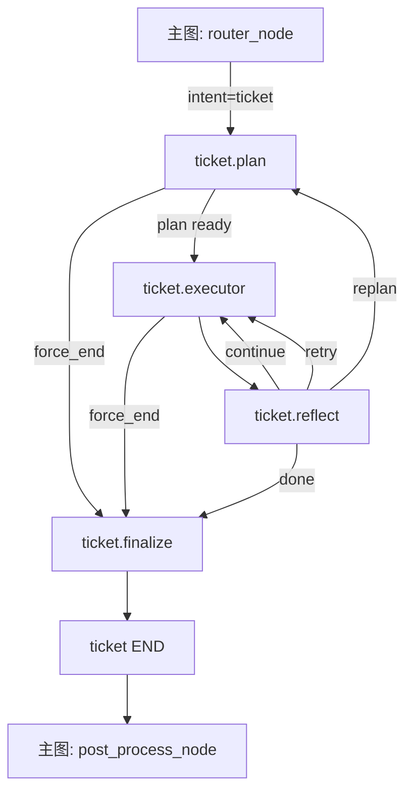

# Ticket 子图当前项目设计方案与技术方案

## 1. 文档定位

本文是当前项目中 `ticket` 子图的唯一总设计文档，目标是让任何人在不依赖历史线程、不依赖口头上下文的前提下，仅通过本文就能掌握项目的业务目标、系统边界、状态模型、工作流设计、交互协议、失败策略和工程实现原则。

本文不是历史复盘文档，不讨论旧方案为何失败，也不以当前代码实现为准绳解释现状。本文只定义当前项目应当遵循的产品设计和技术设计。

## 2. 设计优先级与判定规则

当以下来源发生冲突时，按如下优先级判定：

1. 最新确认的方案优先于更早的方案
2. 当前上下文中重新确认过的方案优先于原始文档
3. 当前代码只作为参考，不可信时必须服从设计文档

因此本文中的内容一旦与现代码不一致，应视为代码待修正，而不是设计需要回退。

## 3. 项目目标

`ticket` 子图负责处理用户在品牌服务场景下的工单类诉求，覆盖以下能力：

- 发起工单
- 查询工单进度
- 订单定位与订单选择
- 商品定位与商品选择
- 工单定位与工单选择
- 写操作前确认
- 连续服务承接
- 失败后的自主重规划
- 成功、失败、取消的统一收口

`ticket` 子图的设计目标不是“把一次对话答完”，而是“把一个工单任务拆成正式步骤，并稳定推进到可结束状态”。

## 4. 核心设计原则

### 4.1 总体原则

- 任务建模优先于代码结构
- 正式步骤优先于散落逻辑
- 大模型负责业务判断、路径选择与失败恢复策略
- 规则层只保留系统安全边界
- 交互必须是正式步骤，不允许临时插补
- 最终回复必须统一由结束节点生成
- 设计方案优先于当前代码

### 4.2 LLM 与规则的职责边界

大模型负责：

- 识别当前工单目标
- 规划正式步骤
- 选择失败后的业务策略
- 在重规划时根据执行过程改写步骤
- 决定何时改用追问、选择、展示信息而非继续重试

规则层负责：

- 全局循环上限
- 单步重试上限的技术边界
- 重规划上限
- schema 校验
- 工作流显式流转
- 不可恢复场景的最终收口

禁止把“某类业务错误该不该 retry”“某个工具是否应该换路”写死在硬编码里。

## 5. 业务范围

### 5.1 支持的 scene

- `refund`：退货
- `change`：换货
- `quality`：质量问题、破损问题
- `complain`：投诉
- `equity`：权益申请、会员升级相关诉求

### 5.2 支持的 mode

- `create`
- `query`
- `update`
- `cancel`
- `resume`

### 5.3 非目标

以下能力不属于 `ticket` 子图内部职责：

- 多意图总调度
- 非 ticket 服务的推荐或问答
- 长期记忆策略本身
- 前端渲染逻辑
- 中间过程 UI 解释文案

这些能力由主图或外层系统负责。

## 6. 主图与 ticket 子图的职责边界

### 6.1 主图职责

主图负责：

- 路由当前意图
- 构造初始 `AgentState`
- 预加载 `user_context`
- 检测线程中是否有 pending interrupt
- 在子图结束后统一进入 `post_process`
- 若存在 `intent_queue`，继续调度后续意图

### 6.2 ticket 子图职责

`ticket` 子图只负责当前 ticket 主任务，不负责：

- 识别和消费其他意图
- 对外层对话做统一聚合
- 维护长期记忆结构

`ticket` 子图的输入是当前会话上下文与用户本轮输入，输出是：

- 更新后的 ticket 运行态
- `final_reply`

## 7. ticket 子图工作流

### 7.1 标准结构

当前标准工作流为：

```text
plan -> executor -> reflect -> (executor | plan | finalize)
```

结束统一经过：

```text
... -> finalize -> END
```

### 7.2 节点定义

- `plan`
  - 只负责生成正式 `TicketPlan`
  - 不直接触发 interrupt
  - 重规划时只负责重写失败点及其后续 tail
- `executor`
  - 统一执行正式步骤
  - 统一触发 ask/select/confirm/show_info 中断
  - 不负责业务猜测，不硬编码补字段
- `reflect`
  - 读取执行结果
  - 读取当前步骤 metadata 中的失败策略
  - 在规则边界内决定 `continue / retry / replan / done`
- `finalize`
  - 统一生成成功、失败、取消场景下的最终回复

### 7.3 Mermaid 数据流图



## 8. 状态模型

### 8.1 AgentState

主图与所有子图共享的基础状态包括：

- `user_id`
- `thread_id`
- `channel`
- `messages`
- `final_reply`
- `intent`
- `reason`
- `is_continuous`
- `continuity_type`
- `is_direct_reply`
- `intent_queue`
- `completed_replies`
- `service_entry_message`
- `emotion_score`
- `user_context`
- `compensation_issued`
- `token_usage_total`
- `interaction`

### 8.2 TicketState

`ticket` 子图专有状态包括：

- 业务态
  - `ticket_scene`
  - `ticket_mode`
  - `current_goal`
  - `slots`
  - `selected_entities`
  - `ticket_context_minimal`
- 计划态
  - `plan`
  - `plan_version`
  - `current_step_index`
  - `step_history`
- 控制态
  - `loop_count`
  - `step_retry_count`
  - `auto_resolve_budget`
  - `reflect_action`
  - `final_status`
  - `final_reason`
  - `need_replan`
  - `force_end`
- 交互态
  - `active_interrupt`
  - `last_user_response`
  - `collected_info`

### 8.3 状态设计原则

- 所有推进都围绕正式 plan 和 step 进行
- 所有执行结果都进入 `step_history`
- 所有用户补充信息都进入 `slots`、`selected_entities` 或 `collected_info`
- 不允许靠局部变量保存关键工作流状态

## 9. 核心 schema

### 9.1 TicketPlan

`TicketPlan` 是 planner 的唯一正式输出，字段包括：

- `goal`
- `scene`
- `mode`
- `summary`
- `required_slots`
- `missing_slots`
- `steps`
- `version`
- `metadata`

### 9.2 TicketStep

每个正式步骤必须包含：

- `id`
- `kind`
- `purpose`
- `tool`
- `input`
- `interaction`
- `prompt`
- `completion_signal`
- `slot_targets`
- `metadata`

### 9.3 StepKind

支持的正式步骤类型：

- `tool`
- `ask_user`
- `select`
- `confirm`
- `show_info`
- `finalize`

### 9.4 StepResult

每次步骤执行后的沉淀结果包括：

- `step_id`
- `kind`
- `status`
- `ok`
- `tool`
- `error_code`
- `data`
- `normalized`
- `user_response`
- `interaction`
- `summary`
- `machine_reason`

### 9.5 failure policy

每个步骤的 `metadata` 中应尽量包含：

- `failure_policy`
  - `retry | replan | ask_user | select | show_info | fail`
- `max_retries`
- `retry_hint`
- `fallback_policy`

原则：

- 默认应视为 `replan`，不是 `retry`
- 只有“再次执行同一能力本身就能提高成功率”的步骤，才允许 `retry`
- 一切业务判断由 LLM 写入 step metadata
- reflect 不负责用硬编码改写业务判断

## 10. 交互协议

### 10.1 交互类型

系统统一使用以下交互类型：

- `select_order`
- `select_product`
- `confirm_order`
- `confirm_product`
- `select_ticket`
- `confirm_ticket`

### 10.2 通用结构

```json
{
  "interaction_type": "select_order",
  "items": [
    {
      "key": "ORD-001",
      "label": "ORD-001（短袖T恤×1）",
      "detail": {},
      "selectable": true
    }
  ]
}
```

### 10.3 字段词典

交互 `detail` 中应优先使用统一对象字段。

订单对象推荐字段：

- `order_id`
- `status`
- `status_label`
- `source_channel`
- `items_summary`
- `items`
- `created_at`
- `biz_id`

订单中的商品项推荐字段：

- `order_item_id`
- `product_id`
- `sku_id`
- `name`
- `qty`

商品对象推荐字段：

- `product_id`
- `sku_id`
- `name`
- `specs`
- `qty`
- `stock`
- `price`
- `order_item_id`

工单对象推荐字段：

- `ticket_id`
- `ticket_type`
- `status`
- `title`
- `latest_progress`
- `expected_finish_time`
- `created_at`
- `biz_id`

权益/等级对象推荐字段：

- `name`
- `target_level`
- `current_level`
- `rule`
- `description`
- `effective_time`

### 10.4 命名规范

- 使用 `qty`，不使用 `quantity` 作为交互 `detail` 主字段
- 使用 `specs`，不使用 `spec` 或 `attributes`
- 使用 `status` 表示机器态，`status_label` 表示展示态
- 使用 `latest_progress`
- 使用 `created_at`
- 使用 `source_channel`

### 10.5 skill 中的协议要求

每个 `SKILL.md` 必须：

- 只保留本 skill 真实可能使用到的交互类型
- 对保留的每一种交互都给出带具体 `detail` 的 JSON 示例
- 工具定义与交互示例的字段命名必须与字段词典一致

## 11. Skill 设计

### 11.1 当前 skill 划分

当前采用三份业务 skill：

- `refund-ticket`
- `unsatisfy-ticket`
- `equity-ticket`

### 11.2 skill 的职责

每份 skill 负责定义：

- 适用场景
- 业务规则
- 处理流程
- 可用工具与关键入参/输出
- 当前场景可用的交互类型与 JSON 示例
- 当前场景特有的规划要点

### 11.3 skill 的设计原则

- skill 是业务规则，不是事实来源
- skill 不能覆盖真实工具结果
- skill 不负责表达当前用户事实
- skill 不应引入与本场景无关的工具和交互

## 12. Prompt 设计

### 12.1 plan prompt 职责

planner prompt 只负责：

- 理解当前工单目标
- 生成正式 `TicketPlan`
- 根据已执行过程和失败结果进行重规划
- 为每个步骤给出失败策略

planner prompt 不负责：

- 直接向用户发问
- 直接控制中断
- 在 executor 外执行逻辑

### 12.2 信息优先级

planner 必须按以下优先级理解输入：

1. 当前用户本轮最新明确表达或纠正
2. 最近一次工具结果、失败结果、用户选择与确认结果
3. 当前 `collected_info`、`slots`、`selected_entities`
4. 当前已有计划及失败记录
5. 用户上下文
6. skills

### 12.3 replan_tail

当进入 replan 时，planner 不应重新规划整个链路，而应：

- 保留已完成前缀步骤
- 仅重写失败点及其后续 tail
- 明确避免机械重复无新增信息支撑的失败步骤

### 12.4 Prompt 输入最小化

planner 输入应控制在最小必要范围：

- 只注入相关 skill
- 只注入最近必要执行历史
- 只注入当前服务必要用户上下文

避免把完整画像、无关历史、整段无差别技能集合全部塞给 planner。

## 13. 节点设计

### 13.1 plan

职责：

- 生成 `TicketPlan`
- 选择当前相关 skill
- 识别 scene 与 mode
- 在 replan 时输出新的 tail
- 为每个步骤写入 `failure_policy` 等 metadata

约束：

- 不直接 interrupt
- 不做字段硬补
- 不做执行控制

### 13.2 executor

职责：

- 按 `current_step_index` 执行当前正式步骤
- 对 `ask_user`、`select`、`confirm`、`show_info` 统一发出 `interrupt`
- 执行 tool 并封装结果
- 记录 `step_history`

约束：

- 不负责业务推断
- 不硬编码猜字段
- 不擅自决定 retry

### 13.3 reflect

职责：

- 根据 `step_history` 判断当前步骤是否成功
- 根据当前 step metadata 决定 `retry / replan / done`
- 在成功时推进到下一步
- 在超过安全边界时强制失败收口

约束：

- 业务策略优先读步骤 metadata
- 规则仅负责上限和确定性流转

### 13.4 finalize

职责：

- 统一生成成功、失败、取消的最终回复
- 统一处理暂停等待补充信息的回复
- 根据用户情绪适当补 empathy 前缀

约束：

- 所有结束都必须经过 finalize
- 其他节点不直接生成最终用户回复

## 14. 工具层设计

### 14.1 工具元数据

工具层需要统一维护元数据：

- `kind`
  - `read | write`
- `domain`
- `required_fields`
- `idempotent`
- `result_schema`

### 14.2 统一结果封装

所有工具结果都需统一封装为：

- `ok`
- `tool`
- `error_code`
- `idempotent`
- `meta`
- `data`
- `normalized`
- `interaction`

### 14.3 normalized 的职责

`normalized` 负责把原始接口结果抽成稳定的工作流语义对象，例如：

- `orders`
- `order_items`
- `products`
- `tickets`
- `ticket`
- `membership`

executor 和 reflect 优先消费统一结果，不直接依赖原始接口返回形状。

## 15. 失败恢复与重试策略

### 15.1 核心原则

- 不再使用 `retryable` 这类硬编码业务判断
- 由 planner 在步骤 metadata 中声明失败策略
- reflect 只消费该策略

### 15.2 retry 规则

仅当当前步骤 metadata 声明：

- `failure_policy = retry`
- 且 `step_retry_count < max_retries`

时，reflect 才允许 retry。

### 15.3 replan 规则

当步骤失败且：

- `failure_policy != retry`
- 或 `retry` 已耗尽
- 或用户交互后需要改写路径

则进入 replan。

### 15.4 全局护栏

系统级安全边界应至少包括：

- 最大反思循环次数
- 最大重规划次数
- 单步最大重试次数上限
- token budget 上限

一旦超过边界，必须进入 finalize 失败收口。

## 16. 连续服务与用户上下文

### 16.1 主原则

`ticket` 子图可以使用用户上下文，但只能注入当前推进所需的最小必要信息。

### 16.2 可注入内容

- 用户基础画像摘要
- 最近一轮连续服务上下文
- 与当前 scene 强相关的记忆
- 当前 channel

### 16.3 禁止事项

- 不能把完整画像全文直接喂给 planner
- 不能让历史记忆覆盖最新用户表达
- 不能用历史上下文替代真实工具查询结果

## 17. 对外输出协议

### 17.1 当前原则

接口链路中的中间过程输出应当保持极简，不以“展示内部思考过程”为目标。

### 17.2 对前端透出的必要字段

保留以下响应字段即可：

- `thread_id`
- `reply`
- `interaction`

不应依赖大量中间过程事件驱动产品主流程。

### 17.3 中断恢复

- 当 executor 进入交互步骤时，通过 `interrupt` 抛出问题和交互 payload
- 用户下一次输入时，主图通过 `Command(resume=user_message)` 恢复
- 恢复后仍在当前线程内继续推进

## 18. 性能与工程原则

### 18.1 planner 性能原则

- 优先精简 skill 本身，而不是依赖运行时复杂裁剪
- replan 优先使用 `replan_tail`，避免全量重算
- 执行历史只提供最近必要信息，不做全量回放

### 18.2 技术实现原则

- 所有正式代码遵循 ASCII 优先
- 不在 executor 中堆业务硬编码
- schema 和文档先行
- 任何和本文冲突的实现，都应视为待修正实现

## 19. 实施验收标准

当以下条件同时成立时，认为 `ticket` 子图符合设计：

- planner 只输出正式步骤，不直接 interrupt
- executor 统一解释所有步骤
- reflect 的业务判断来自 step metadata，而不是硬编码错误分类
- finalize 统一生成所有结束回复
- 重规划能看到执行历史并只改写失败点后的 tail
- 交互协议在各 skill 中自洽且字段一致
- 主图与子图职责边界清晰
- SSE 输出保持简洁，不暴露大量中间过程

## 20. 最终结论

当前项目中，`ticket` 子图的标准形态应定义为：

- 一个由 `plan -> executor -> reflect -> finalize` 组成的正式 LangGraph 子图
- 一个由 `TicketPlan / TicketStep / StepResult / TicketState` 驱动的步骤系统
- 一个由 skill 提供业务规则、由 planner 生成失败策略、由 reflect 消费失败策略的 LLM 主导方案
- 一个由统一交互协议和统一字段词典支撑的工单处理系统

后续无论换线程、换实现人、换具体代码，只要仍在做当前项目的 `ticket` 子图，就应以本文为准。
