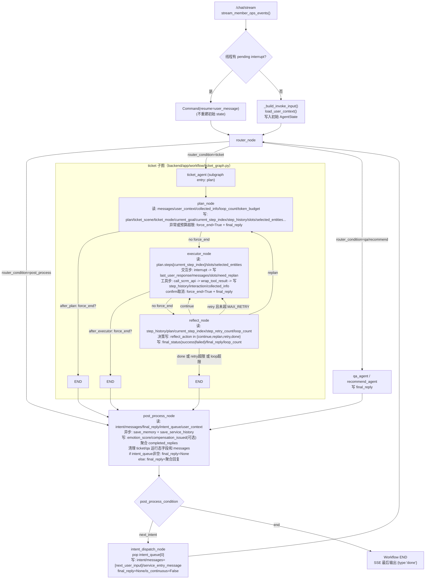
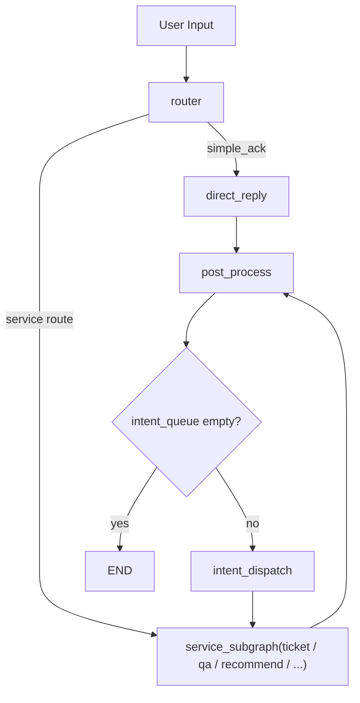
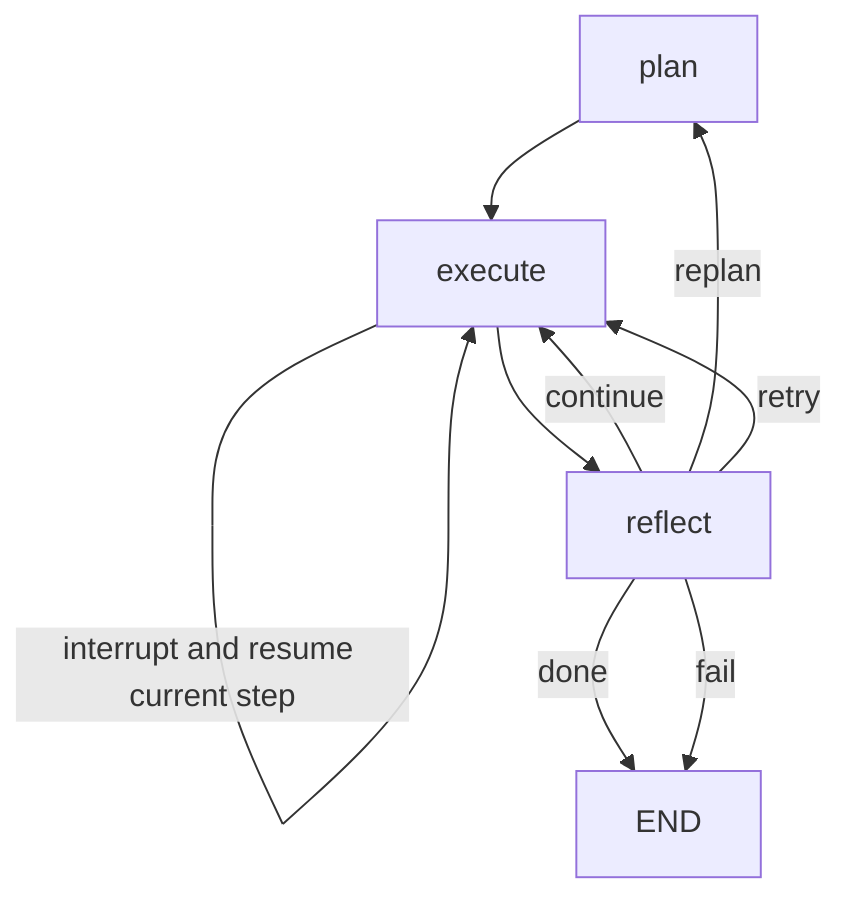

# Ticket 子图设计文档（重写基线版）

## 1. 文档目标

本文定义 `ticket` 子图全量重写的功能设计与技术设计基线。

目标不是解释当前实现，而是明确：

1. 当前 `ticket` 相关代码、`skills/`、`prompts/` 已覆盖哪些产品功能
2. 历史 `ticket_agent` 有哪些能力可继承，哪些实现方式应放弃
3. 新的 `ticket` 子图在功能层应如何定义
4. 新的 `ticket` 子图在技术层应如何实现
5. 在尽量少增 node 的前提下，如何保证链路清晰、稳定、可中断、可交互、可观测

本文是后续实现、拆任务、评审 prompt 和 state 设计的统一依据。

## 1.1 当前实现状态

截至当前版本，本文中的以下核心设计已经落地：

- `TicketState` 已按新模型重写
- `TicketPlan / TicketStep / StepResult / ActiveInterrupt / TicketSlots / TicketContextMinimal` 已落地
- `ticket` 子图已收敛为 `plan -> execute -> reflect`
- `plan` 已切换为原生输出 `TicketPlan`
- `execute` 已成为统一步骤解释器
- `reflect` 已改为“规则优先，LLM 兜底”
- 旧的 `other_intent` 子图节点已移出主链路并删除
- 旧版 `ticket_plan.txt` 已保留为对照版本
- 节点级与链路级回归测试已补充，并可通过

当前仍未完全落地的部分：

- 工具层统一元数据与统一结果封装仍未完整实现
- 面向真实前端的更完整流式事件验证仍需补充
- 主图层 `intent_queue` 的后续消费链路还未专项重构
- 记忆系统仍为 mock，尚未按新链路重新设计

因此，这份文档现在既是设计基线，也是当前 ticket 子图实现状态的说明文档。

## 1.2 当前代码数据流转图（严格按现实现）



---

## 2. 设计约束

重写必须满足以下约束：

- 以 `skills/` 为业务规则基准
- 以现有交互协议为基准
- 以现有接口结构为基准
- `ticket` 子图的 state 可以完全重写
- `ticket` 子图所有节点都允许完全重写
- `ticket` 相关 prompt 允许重写，但 `ticket_plan.txt` 若重写必须保留原始文件用于对比
- 子图主体仍以 `Plan-and-Executor-Reflect` 模式为核心
- 若考虑改用 `ReAct`，必须先分析优劣势并说明为什么更适合
- workflow 尽量保持最小改动，如非必要不增加过多 node

---

## 3. 当前能力基线

### 3.1 当前业务范围

根据 `skills`、`prompt`、`state` 与当前子图实现，当前 `ticket` 已覆盖以下业务范围：

- `refund`：退货
- `change`：换货
- `quality`：质量/破损问题
- `complain`：投诉
- `equity`：权益申请 / 会员升级相关申请

### 3.2 当前产品能力已覆盖的内容

从当前代码、skills 和 prompt 可以确认，现有系统已经明确要求支持以下能力：

- 发起工单
- 查询工单进度
- 查询并选择订单
- 查询并选择商品
- 查询并选择工单
- 写操作前确认
- 缺失信息时追问用户
- 单步执行后反思并决定继续 / 重规划 / 重试 / 完成 / 失败
- 连续服务承接
- 过程事件透传给前端

也就是说，当前系统的问题不是“功能定义缺失”，而是“任务模型和实现边界不稳定”。

### 3.3 当前业务规则基准：skills

当前 `skills` 是重写时最重要的业务基准：

- [backend/app/skills/refund-ticket/SKILL.md](/Users/xyg/就业/AI/Agent/i-member/backend/app/skills/refund-ticket/SKILL.md)
- [backend/app/skills/equity-ticket/SKILL.md](/Users/xyg/就业/AI/Agent/i-member/backend/app/skills/equity-ticket/SKILL.md)
- [backend/app/skills/unsatisfy-ticket/SKILL.md](/Users/xyg/就业/AI/Agent/i-member/backend/app/skills/unsatisfy-ticket/SKILL.md)

skills 已明确了以下关键业务规则：

- 优先查，不先问
- 多商品订单必须先选商品
- 写操作前必须确认
- 质量问题必须有凭证图片
- 订单类工单必须带 `source_channel`
- 不向用户暴露内部术语
- 结果只展示必要信息，敏感字段要脱敏
- 工单成功创建后回复必须包含工单编号、状态、预计处理时效或下一步指引

这些规则应视为子图的业务规范，而不是“给 LLM 的参考建议”。

### 3.4 当前交互协议基准

现有交互协议已经比较稳定，重写时应直接沿用：

- `select_order`
- `select_product`
- `confirm_order`
- `confirm_product`
- `select_ticket`
- `confirm_ticket`

统一结构：

```json
{
  "interaction_type": "select_order",
  "items": [
    {
      "key": "ORD-001",
      "label": "ORD-001（短袖T恤×1）",
      "detail": {},
      "selectable": true
    }
  ]
}
```

### 3.5 当前接口结构基准

当前接口结构也应视为稳定基准，子图围绕这些工具工作：

- 订单：`get_user_orders`、`get_order_detail`
- 商品：`search_product`、`get_product_detail`、`get_product_stock`
- 用户：`get_user_level`、`get_user_score` 等
- 工单：`create_ticket`、`get_ticket`、`get_tickets`
- 其他写操作：`upgrade_membership`、`issue_compensation_coupon`

对应代码：

- [backend/app/tools/scrm_tools.py](/Users/xyg/就业/AI/Agent/i-member/backend/app/tools/scrm_tools.py)

---

## 4. 当前实现的主要问题

### 4.1 plan 职责过重且边界不清

该问题已在当前实现中完成修复。

当前 `plan_node` 同时承担：

- 目标理解
- 步骤规划
- 缺失信息判断
- 追问问题生成
- 直接中断
- 局部交互选择逻辑

这会导致 planner 既做“决策”，又做“执行控制”，职责不清。

### 4.2 交互不是正式步骤，而是散落在代码中的补丁

该问题已在当前实现中完成修复。

当前交互分散在：

- planner prompt
- `plan_node` 中断逻辑
- `executor_node` 根据工具名推断交互

这意味着系统没有统一的交互步骤模型。

### 4.3 多意图承接位置不合理

该问题已在当前 ticket 子图内完成修复，主图后续消费仍待专项整理。

当前 ticket 子图内存在 `other_intent_node`，但多意图本质属于主图编排问题，不应由 ticket 子图内部负责识别和排队。

更合理的职责边界应是：

- `router` 负责主意图与 `intent_queue`
- `ticket` 子图只负责当前 ticket 主任务
- 子图结束后再由主图或后处理决定是否继续消费队列

### 4.4 反思过度依赖 LLM

该问题已在当前实现中部分修复。

当前 reflect 很多本可规则判断的场景仍依赖模型：

- 当前是否还有下一步
- 当前步骤是否明确成功
- 是否属于临时错误
- 是否已经无进展

如果不前置规则，反思稳定性会长期偏弱。

### 4.5 无限循环风险存在

该问题已在当前实现中部分修复。

当前系统虽然已有计数器，但仍有潜在循环风险：

- 不断 replan 但计划无实质变化
- 不断重试同一自动补全步骤
- 不断追问同一类问题
- 用户答非所问后不断在 plan / executor 之间来回

重写必须显式设计防循环机制，而不是事后补保护。

### 4.6 用户画像注入缺少边界

该问题已在当前实现中部分修复。

当前系统有用户画像和最近服务上下文注入能力，这个方向是对的，但需要控制粒度。

如果把完整画像、历史行为、长期记忆大段注入 planner，会产生两个问题：

- planner 被无关信息污染
- token 成本和规划不稳定性上升

因此需要从“是否注入”改成“注入哪些最小必要信息”。

---

## 5. 历史 ticket_agent 分析

历史实现见 `HEAD` 中的 [backend/app/agents/ticket.py](/Users/xyg/就业/AI/Agent/i-member/backend/app/agents/ticket.py)。

### 5.1 历史实现已具备的能力

旧 `ticket_agent` 已具备以下方法论雏形：

- `plan -> execute -> reflect`
- 信息不足时追问
- 按需加载 skill 详情
- 工具调用和结果汇总
- 最终回复生成

### 5.2 历史实现不适合延续的部分

- 单节点串行控制
- 一次性执行整个 plan
- 写操作确认没有真实闭环
- mock 工具体系
- 缺少正式 state 模型
- 缺少稳定的中断恢复链路

### 5.3 结论

历史 `ticket_agent` 值得继承的是思路，不值得继承的是实现方式。

重写后的 ticket 子图应保留：

- plan-execute-reflect 的主骨架
- skill 驱动规划

应放弃：

- 单节点大函数
- 一次性跑完整个计划
- 用局部变量承担工作流状态

---

## 6. 核心设计原则

### 6.1 设计原则

1. 先定义任务模型，再定义节点
2. 先定义交互步骤，再定义中断逻辑
3. planner 只负责规划，不直接承担追问执行
4. executor 统一执行工具步骤和交互步骤
5. reflect 规则优先，LLM 兜底
6. 多意图不在 ticket 子图内部识别
7. 自动补全有预算，超限再问用户
8. 前端展示过程说明，不展示原始 LLM 推理
9. 优先收敛 schema 和状态，不优先增加 node

### 6.2 关于用户画像注入

用户画像注入有必要，但只能采用“最小必要上下文”。

planner 允许注入的内容建议仅包括：

- 当前用户基础身份信息
- 渠道信息
- 最近一轮服务摘要
- 与当前 ticket 高相关的少量长期记忆
- 会员等级 / 账户状态等可能影响决策的关键信息

planner 默认不应注入：

- 全量用户行为流水
- 与当前问题无关的兴趣偏好
- 大段历史对话原文
- 过多结构化画像字段

结论：

- 不是取消用户画像注入
- 而是把它收敛成 `ticket_context_minimal`

---

## 7. 新的功能设计

### 7.1 设计目标

新的 ticket 子图应覆盖以下能力：

- 退货、换货、质量问题、投诉、权益申请五类主场景
- 发起、查询、补充、修改、取消五类办理模式
- 单轮中断、跨轮恢复、继续办理
- 任意阶段向用户追问、展示信息、请求选择、请求确认
- 前端可见的过程事件
- 自动补全与人工补充的协同
- 多意图队列衔接

### 7.2 办理模式

建议将 ticket 任务统一抽象为 5 种 `mode`：

- `create`：发起新工单
- `query`：查询已有工单进度
- `update`：补充或修改办理信息
- `cancel`：取消当前正在执行的操作
- `resume`：在连续服务中继续之前未完成的办理

### 7.3 场景分类

建议将业务场景统一抽象为 `scene`：

- `refund`
- `change`
- `quality`
- `complain`
- `equity`

其中：

- 工单进度查询不再作为独立 scene，而是作为对应业务场景下的查询型诉求处理

### 7.4 功能域

#### A. 诉求受理

进入 ticket 子图后，系统必须先明确：

- 用户当前在办理什么
- 当前办理属于哪个 scene
- 当前属于哪种 mode

#### B. 上下文补全

系统必须从已有上下文补全：

- 最近服务信息
- 已确认槽位
- 当前线程中已选订单 / 商品 / 工单
- 最小必要画像信息

#### C. 自动补全

系统应优先通过工具查询补齐信息，而不是直接问用户。

#### D. 用户交互

当自动补全无法继续时，系统应能：

- 追问用户
- 展示候选项让用户选择
- 展示已查到的信息让用户确认
- 展示当前执行说明，让用户继续

#### E. 写操作控制

所有写操作前必须确认。

#### F. 单步反思

每一步执行后必须决定：

- 继续
- 重规划
- 重试
- 完成
- 失败

#### G. 主图衔接

ticket 子图完成后，主图可继续处理 `intent_queue` 中的其他意图。

---

## 8. 新的任务模型设计

### 8.1 为什么要重写任务模型

当前 plan 只适合输出“工具步骤”，不适合输出“完整办理步骤”。

但在真实 ticket 子图中，步骤不仅包括：

- 查接口

还包括：

- 问用户
- 让用户选择
- 让用户确认
- 向用户展示信息并暂停等待继续

因此重写后必须引入正式的步骤模型。

### 8.2 TicketPlan 结构

建议新的 `TicketPlan` 至少包含以下字段：

```json
{
  "goal": "一句话目标",
  "scene": "refund|change|quality|complain|equity",
  "mode": "create|query|update|cancel|resume",
  "summary": "当前规划摘要",
  "required_slots": ["order_id"],
  "missing_slots": [
    {
      "name": "order_id",
      "required": true,
      "reason": "订单相关工单必须定位订单",
      "preferred_action": "auto_lookup|select|ask_user"
    }
  ],
  "steps": [
    {
      "id": "step_1",
      "kind": "tool",
      "purpose": "查询候选订单",
      "tool": "get_user_orders",
      "input": {
        "page": 1,
        "page_size": 5
      }
    }
  ]
}
```

### 8.3 TicketStep 类型

建议只保留以下 6 种步骤类型：

- `tool`
- `ask_user`
- `select`
- `confirm`
- `show_info`
- `finalize`

定义如下：

#### `tool`

调用工具查询或写入。

#### `ask_user`

文本追问，适用于用户只能自然语言补充的信息，如：

- 问题描述
- 退款原因
- 附件说明

#### `select`

展示候选项让用户选，如：

- 选择订单
- 选择商品
- 选择工单

#### `confirm`

用于写操作前确认，或对关键识别结果进行确认。

#### `show_info`

向用户展示已查到的重要信息，并允许用户继续、修改或取消。

#### `finalize`

生成最终面向用户的结果回复并结束。

### 8.4 为什么交互必须是正式步骤

把交互建模成正式步骤，而不是散落在节点里的中断补丁，有三个好处：

- planner 只做规划，职责清晰
- executor 可以统一处理中断与恢复
- reflect 可以对“交互结果”也做正式判断，而不是只理解工具结果

---

## 9. 自动补全与追问策略

### 9.1 基本原则

坚持 `skills` 里的原则：

- 能查到的信息优先查
- 查不到再问

### 9.2 自动补全预算

重写后不建议写死成“所有信息都 tool 重试 3 次”。

更合理的做法是引入 `auto_resolve_budget`：

- 每类自动补全动作有独立预算
- 默认 2 到 3 次
- 同类查询没有新信息增量时，不再重复尝试

建议规则：

- `无结果`：允许有限次扩大查询条件
- `结果过多`：尽快转为 `select` 让用户选择
- `缺关键字段`：转为 `ask_user`
- `权限错误`：直接失败或降级说明，不继续自动重试
- `接口临时错误`：可以重试，但受 `step_retry_count` 限制

### 9.3 追问触发条件

只有在以下情况才向用户追问：

- 工具无法自动定位目标对象
- 写操作缺少阻塞字段
- skills 明确要求必须由用户提供，如图片凭证
- 连续自动补全无进展

---

## 10. 多意图承接设计

### 10.1 设计原则

多意图不在 ticket 子图内部识别。

原因：

- 多意图本质属于主图编排问题
- 如果在 ticket 内部再识别，会导致子图职责膨胀
- 容易出现子图既办理 ticket 又维护路由队列的混乱状态

补充原则：

- “一轮服务”定义为一次完整的子图服务，而不是一次用户发言
- 同一条用户消息中若存在多个意图，应视为多个子图服务顺序执行
- `post_process` 是真正的后处理节点，只负责某一轮完整服务结束后的收尾，不负责决定是否进入下一轮服务

### 10.2 推荐职责边界

#### `router`

负责：

- 连续性判断
- 当前主意图判断
- `intent_queue` 初始化
- 当前轮入口路由

#### `ticket` 子图

负责：

- 只处理当前 ticket 主任务
- 不中途主动识别新的其他意图

#### `intent_dispatch` 或主图编排逻辑

负责：

- 在某一轮服务完成后检查 `intent_queue`
- 如有剩余意图，分发到下一轮服务
- 不承担服务记忆存储与清理逻辑

#### `post_process`

负责：

- 产出本轮服务记忆
- 清理本轮运行态
- 触发收尾型异步任务
- 不承担下一轮服务调度

### 10.3 ticket 子图内唯一允许的“偏离主意图”场景

如果用户在中断恢复时明确改口，例如：

- “不退了”
- “先别查这个了”
- “我其实是想问积分”

则 executor 或 reflect 可以将当前任务标记为：

- `cancel_current_ticket`
- `exit_to_router`

但这不是“识别多意图”，而是“当前任务中止并交还主流程”。

### 10.4 推荐主图流转

推荐主图使用以下职责边界：



该图表达的含义是：

- `router` 一次完成连续性、简单收口与本轮进入哪个子图的判断
- 子图完成后进入 `post_process`
- `post_process` 只做本轮收尾
- 是否继续处理 `intent_queue`，由主图编排节点 `intent_dispatch` 决定

### 10.5 为什么不让 `post_process` 兼任分发

原因：

- `post_process` 的职责是收尾，而不是调度
- 收尾与调度混在一起，会导致 messages 清理时机混乱
- 连续服务与多意图分发本质是两个问题，不应在同一节点处理

因此推荐：

- `post_process` 只处理“本轮服务已完成后要做什么”
- `intent_dispatch` 只处理“下一轮服务去哪里”

---

## 11. 前端可见过程设计

### 11.1 设计目标

前端不应该只看到最终回复，还应该看到过程。

### 11.2 前端应看到的内容

建议前端可见以下信息：

- 当前服务目标
- 当前进入的步骤
- 当前在查什么 / 为什么查
- 当前需要用户补什么信息
- 当前需要用户选择什么
- 当前需要用户确认什么
- 当前工具查询到的关键信息摘要
- 最终处理结果

### 11.3 前端不应看到的内容

不建议向前端透出：

- 原始 chain-of-thought
- 模型长推理文本
- 原始 reflect 内部分析

可透出的应是“过程说明”，而不是“模型脑内推理”。

### 11.4 建议的过程事件

建议保留并扩展流式事件：

- `reply`
- `interaction`

其中：

- `step_enter`：进入某一步
- `step_result`：该步骤完成后的结果摘要

---

## 12. 防无限循环设计

防循环必须是结构设计，不是补丁。

### 12.1 计数器保护

至少保留三类计数器：

- `loop_count`：整个 ticket 子图最大循环次数
- `step_retry_count`：单步骤最大重试次数
- `auto_resolve_budget`：单类自动补全最大次数

### 12.2 无进展检测

必须增加无进展检测规则：

- 连续两次 replan 后 step 列表无实质变化
- 连续两次都在问同一槽位
- 连续两次自动查询结果没有新增信息
- 连续多轮都停留在同一逻辑目标

一旦触发无进展，应：

- 转为向用户明确说明需要补充什么
- 或失败收口
- 或交回主图

### 12.3 反思动作限流

建议限制：

- `retry` 连续次数上限
- `replan` 连续次数上限
- 同一 `step_id` 的重复进入次数上限

---

## 13. 推荐 workflow 设计

### 13.1 结论

推荐仍以 `Plan-and-Executor-Reflect` 为 ticket 子图核心。

### 13.2 推荐节点结构

在“尽量少增 node”的约束下，推荐 4 节点主结构：

1. `plan`
2. `execute`
3. `reflect`
4. `finalize` 可选

但考虑到现有主图和流式事件结构，推荐保守方案如下：

1. `plan`
2. `execute`
3. `reflect`
4. `finalize` 仅在需要把最终回复独立化时增加，否则省略

如果坚持最小节点数，推荐 3 节点：

1. `plan`
2. `execute`
3. `reflect`

理由：

- 多意图已移出 ticket 子图
- 追问 / 选择 / 确认全部收敛为 `execute` 内的步骤执行
- 最终回复可以由 `reflect` 产出，不一定需要单独 `finalize`

### 13.3 推荐主流程



### 13.4 为什么推荐 3 节点

因为当前设计目标已经变了：

- 交互不再是节点职责，而是步骤职责
- 多意图不再是子图职责
- 最终收口不一定需要额外节点

这样比旧的 4 节点结构更清晰，也更符合“plan 只负责规划”的原则。

### 13.5 是否允许增加少量高价值节点

允许，但必须满足：

- 节点职责明确
- 明显降低复杂度
- 不增加恢复链路混乱

唯一可能值得增加的节点是：

- `finalize`

适用条件：

- 希望把最终回复生成与 reflect 决策完全拆开
- 希望统一处理最终回复模板、补偿说明、结果摘要

如果没有明确收益，不建议增加。

---

## 14. 节点职责设计

### 14.1 `plan`

职责：

- 读取当前最小必要上下文
- 判断 `scene` 与 `mode`
- 基于 skills 规划正式步骤
- 输出 `TicketPlan`
- 不直接发起中断
- 不直接执行工具

输入：

- 用户最新消息
- 已有槽位
- 已完成步骤结果
- 最近服务摘要
- 精简画像上下文

输出：

- `plan`
- `current_goal`
- `plan_version`

### 14.2 `execute`

职责：

- 作为统一步骤解释器执行当前步骤
- 处理 `tool / ask_user / select / confirm / show_info / finalize`
- 发起中断并在恢复后继续执行当前步骤
- 记录步骤结果

输入：

- 当前 `plan`
- `current_step_index`
- `slots`
- 历史步骤结果

输出：

- `step_result`
- `interaction`
- `messages` 更新
- 必要时 `need_replan`

### 14.3 `reflect`

职责：

- 先做规则判断
- 仅在不确定时调用 LLM reflect
- 输出标准动作：
  - `continue`
  - `replan`
  - `retry`
  - `done`
  - `fail`

输出：

- `reflect_action`
- `final_reply` 或 `machine_reason`

---

## 15. State 重写设计

### 15.1 说明

`ticket` 子图的 state 允许完全重写，因此建议直接按职责分层设计，而不是沿用现有字段堆叠。

### 15.2 推荐分层

#### A. 基础态

- `user_id`
- `thread_id`
- `channel`
- `messages`
- `user_context`

#### B. 业务态

- `ticket_scene`
- `ticket_mode`
- `slots`
- `selected_entities`
- `current_goal`

#### C. 计划态

- `plan`
- `plan_version`
- `current_step_index`
- `step_history`

#### D. 控制态

- `loop_count`
- `step_retry_count`
- `auto_resolve_budget`
- `reflect_action`
- `need_replan`
- `force_end`

#### E. 交互态

- `interaction`
- `active_interrupt`
- `last_user_response`

### 15.3 推荐 slots 结构

```json
{
  "ticket_type": "refund",
  "ticket_id": null,
  "order_id": null,
  "order_item_id": null,
  "sku_id": null,
  "product_id": null,
  "source_channel": "app",
  "quantity": 1,
  "issue_type": null,
  "issue_desc": null,
  "attachments": [],
  "target_level": null,
  "biz_id": null
}
```

---

## 16. Prompt 设计建议

### 16.1 planner prompt

planner prompt 应重写，但必须保留原始：

- 当前文件：[backend/app/prompts/ticket_plan.txt](/Users/xyg/就业/AI/Agent/i-member/backend/app/prompts/ticket_plan.txt)
- 重写时建议保留一份原始对照版本，例如：
  - `ticket_plan_legacy.txt`
  - 或 `ticket_plan.v1.txt`

### 16.2 planner prompt 的新职责

planner prompt 只负责：

- 识别当前 ticket 目标
- 判断 scene / mode
- 判断缺失槽位
- 生成正式步骤

planner prompt 不负责：

- 直接中断
- 执行追问
- 执行确认
- 维护多意图队列

### 16.3 reflect prompt

reflect prompt 也建议重写，但职责应收窄：

- 仅处理规则难以覆盖的复杂判断
- 输出标准动作和简短原因
- 必要时产出最终面向用户的说明

---

## 17. Tool 层设计建议

### 17.1 工具元数据

建议为每个工具建立稳定元数据：

- `name`
- `kind`: `read|write`
- `domain`
- `required_fields`
- `retryable`
- `idempotent`
- `result_schema`

### 17.2 工具结果标准化

建议统一工具输出结构：

```json
{
  "ok": true,
  "tool": "get_order_detail",
  "error_code": null,
  "retryable": false,
  "data": {},
  "normalized": {}
}
```

这样 executor 和 reflect 不需要直接理解各种原始接口差异。

---

## 18. Plan-and-Executor-Reflect 与 ReAct 对比

### 18.1 ReAct 的优点

- 模型自由度高
- 对开放式探索类任务更自然
- 工具选择和推理链更灵活

### 18.2 ReAct 的问题

对于 ticket 场景，ReAct 有明显弱点：

- 难以稳定约束交互步骤
- 写操作确认链路更难收敛
- 状态恢复点不如显式步骤模型清晰
- 前端过程事件难统一
- 更容易产生无限试探和链路漂移

### 18.3 Plan-and-Executor-Reflect 的优点

对于 ticket 这种“受控任务流”更合适：

- 计划清晰
- 步骤明确
- 中断恢复点稳定
- 写操作前确认更容易控制
- 反思边界更容易定义
- 前端可观测性更好

### 18.4 结论

本项目 ticket 子图不建议改为纯 ReAct。

推荐继续采用 `Plan-and-Executor-Reflect`，并通过正式步骤模型吸收 ReAct 的部分灵活性，而不是整体切换范式。

---

## 19. 最终方案结论

新的 ticket 子图应采用以下基线：

- 以 `skills` 为业务规则基准
- 以现有交互结构和接口结构为基准
- 以 `Plan-and-Executor-Reflect` 为核心模式
- `plan` 只负责规划，不直接中断
- `execute` 统一执行工具步骤和交互步骤
- `reflect` 规则优先、LLM 兜底
- 多意图承接从 ticket 子图中移出，回到主图或后处理
- 自动补全采用预算机制，超限再问用户
- 前端可见过程说明，但不暴露原始 LLM 推理
- workflow 尽量维持 3 节点主结构，必要时增加 1 个高价值节点

这份设计的核心不是“少写一点代码”，而是把 ticket 子图从“为效果堆逻辑”的实现，重构成“围绕正式任务步骤运行的稳定工作流”。

## 19.1 当前落地结论

当前代码已经达到以下状态：

- `ticket` 子图主体迁移已完成
- 旧版 ticket 内部流控字段已基本清理
- planner 已不再依赖旧版 `PlanOutput`
- 交互步骤已由 `execute` 统一处理
- ticket 子图自身已经不再承担多意图识别
- ticket 上下文已开始按分层优先级注入
- skills 已实现“snapshot 首轮路由 + scene 明确后按需 detail”的主策略
- ticket 常用工具已开始收敛到统一元数据与统一结果 wrapper
- `router` 已开始采用“规则优先，LLM 兜底”
- 主图已开始使用结构化 `intent_queue`
- `intent_dispatch` 已从 `post_process` 中剥离，承担下一轮服务分发
- `post_process` 已开始生成结构化 `service_summary`

接下来更适合推进的是：

- 主图与 `intent_queue` 的完整衔接
- 记忆系统存储层与新链路进一步重新对齐
- 文档与验收清单持续收口

---

## 20. 后续建议的实现顺序

建议按以下顺序落地：

1. 先重写 state 定义
2. 再定义 `TicketPlan / TicketStep` schema
3. 再重写 `plan` 节点
4. 再重写 `execute` 节点
5. 再重写 `reflect` 节点
6. 再调整流式事件
7. 最后重写 prompt

如果要进入实现阶段，下一步最合适的动作是先把：

- `TicketState`
- `TicketPlan`
- `TicketStep`
- `StepResult`

四个核心 schema 定义出来，再开始真正改图。

---

## 21. 记忆系统重构方案

### 21.1 当前问题

当前记忆链路的主要问题不是“没有记忆”，而是“注入边界混乱”。

当前 [backend/app/service/user_context.py](/Users/xyg/就业/AI/Agent/i-member/backend/app/service/user_context.py) 会把以下内容混合加载：

- 用户画像与会员等级
- 用户行为
- 长期记忆 `long_term_memory`
- 最近服务历史 `service_history`
- 最近一轮服务 `last_service`

随后 `format_ticket_context_for_prompt()` 会把“画像 + 长期记忆 + 最近服务”混合格式化后直接注入 planner prompt。

这会带来几个直接问题：

- planner 无法判断哪些信息是当前事实，哪些只是辅助背景
- 旧服务摘要可能污染当前工单办理
- 长期记忆和画像容易压过本轮用户明确表达
- token 成本上升，但稳定性未同步提升
- ticket 子图被 mock 记忆实现反向绑架

因此，记忆系统必须从“混合注入”改成“分层注入 + 优先级消费”。

同时补充一个新的主图级前提：

- 所有服务都保留上一轮服务记忆
- 一旦 `router` 判断为连续服务，主图必须沿用上一轮服务上下文
- 这里的“上一轮完整记忆”不是简单摘要，而是上一轮完整服务结束后的可恢复状态快照

### 21.2 设计目标

新的记忆系统应满足：

- ticket 主链路不依赖 mock 记忆也能正常运行
- 方案必须对所有子图通用，而不是只服务 ticket
- planner 只拿到推进当前任务所需的最小上下文
- 不同来源的信息有明确优先级，而不是混合喂给模型
- 当前轮用户明确表达，可覆盖旧记忆和旧服务摘要
- 工具返回结果优先于模型推断和历史记忆
- 若记忆系统异常，ticket 子图只降级，不中断主链路

### 21.3 主图级完整服务记忆设计

建议新增两个主图级对象：

#### `ServiceMemorySnapshot`

表示“一轮完整子图服务结束后保存的完整记忆快照”。

建议字段：

- `service_id`
- `intent`
- `started_at`
- `ended_at`
- `is_continuous`
- `messages`
- `summary`
- `final_reply`
- `state_snapshot`
- `result_snapshot`

字段含义：

- `messages`：该轮完整服务对话材料
- `summary`：供 `router` 和后续子图快速理解的摘要
- `state_snapshot`：该轮服务结束时保留的完整可恢复状态
- `result_snapshot`：关键结果对象提炼，如 `ticket_id`、`order_id`、`selected_entities`

其中 `summary` 默认应采用结构化摘要，而不是自由文本。

推荐结构：

- `intent`
- `goal`
- `result`
- `point_info`
- `message_summary`

字段说明：

- `intent`：上一轮服务所属子图或意图
- `goal`：上一轮服务的处理目标
- `result`：上一轮服务当前结果或卡点
- `point_info`：关键业务信息，如 `order_id`、`ticket_id`、`ticket_type`、已确认槽位
- `message_summary`：上一轮对话过程摘要，用于辅助 LLM 理解承接语境

#### `ActiveServiceContext`

表示“当前轮服务收到的上一轮服务上下文”。

建议字段：

- `last_service_memory`
- `continuity_type`
- `current_user_input`
- `merged_messages`

字段含义：

- `last_service_memory`：上一轮完整服务记忆
- `continuity_type`：本轮与上一轮的关系，如 `ack`、`supplement`、`confirm`、`cancel`、`modify`
- `merged_messages`：若本轮为连续服务，则为上一轮 messages 与当前轮 messages 的拼接结果

### 21.4 post_process 的职责边界

`post_process` 应严格定义为“本轮完整服务结束后的后处理节点”。

其职责固定为：

1. 生成本轮 `ServiceMemorySnapshot`
2. 若本轮为连续服务，则与上一轮服务记忆整合后再更新存储
3. 清空当前运行态中的临时 state
4. 清空当前运行态中的 `messages`
5. 触发异步型收尾任务，如记忆抽取、服务历史写入

不属于 `post_process` 的职责：

- 下一轮服务调度
- `intent_queue` 消费分发
- 当前轮入口连续性判断

### 21.5 连续服务的整合规则

若当前轮是上一轮服务延续，则整合规则建议如下：

#### `messages`

- 直接按时间顺序拼接
- 上一轮 `messages` 在前
- 当前轮 `messages` 在后

#### `summary`

- 不建议简单字符串拼接
- 应重新生成新的整轮服务摘要

#### `state_snapshot`

- 以当前轮结束时 state 为主
- 保留上一轮仍有效的业务状态
- 当前轮明确更新的字段覆盖上一轮

#### `result_snapshot`

- 优先保留当前轮最新结果
- 同时保留上一轮关键对象引用

### 21.6 state_snapshot 保留原则

这里的“完整记忆就是上一轮完整 state”是成立的，但不建议原样保存 runtime state。

更合适的做法是保存“完整可恢复 state 快照”。

建议保留：

- `intent`
- `is_continuous`
- `messages`
- `final_reply`
- 各子图业务字段
- 各子图的 `plan / step_history / selected_entities / collected_info`
- 当前轮结束时仍对下一轮有价值的控制态

建议不直接保留：

- token 统计类字段
- 仅本轮执行有效的临时计数器
- 不适合跨轮恢复的 interrupt 瞬时态

### 21.7 router 的通用职责

`router` 是主图级能力，不应为 ticket 特化。

建议职责：

- 判断当前消息是否为上一轮服务延续
- 判断是否为简单收口
- 输出建议意图
- 输出连续类型 `continuity_type`

当前推荐的 `continuity_type` 枚举：

- `ack`
- `follow_up`
- `supplement`
- `confirm`
- `cancel`
- `modify`
- `progress_query`
- `unknown`

一旦 `is_continuous=true`，主图必须向目标子图注入上一轮服务摘要。

默认注入顺序建议为：

1. 结构化 `service_summary`
2. 必要时再回退读取完整 `ServiceMemorySnapshot`

也就是说：

- “是否沿用上一轮服务上下文”不是可选项，而是强约束
- 子图只决定“如何消费上下文”，不决定“是否注入上下文”
- 完整记忆是兜底恢复源，结构化 summary 是默认消费入口

### 21.8 信息优先级模型

建议 ticket 场景统一采用以下优先级：

1. 当前轮用户输入与本轮用户显式纠正
2. 当前线程内已确认槽位、已选择对象、已执行步骤结果
3. 本轮最新工具结果
4. 最近一轮连续服务摘要
5. 与当前 scene 强相关的长期记忆
6. 静态用户画像与会员信息

同时补充两条硬规则：

- `skills` 不属于“背景信息”，而属于“业务约束”，其约束级高于所有用户背景信息
- 工具结果高于历史记忆，当前用户明确改口高于旧服务摘要

### 21.9 建议的数据分层

建议将 ticket 可消费上下文拆成 4 层，而不是一个大对象：

#### A. 实时事实层 `runtime_facts`

仅包含当前 ticket 子图运行事实：

- 当前用户输入
- `slots`
- `selected_entities`
- 当前计划
- 最近步骤结果
- 当前中断与恢复信息

这一层不属于外部记忆，而属于 ticket state 本身，优先级最高。

#### B. 连续服务层 `continuity_context`

仅在 `is_continuous=true` 时注入，且只保留最近 1 轮与当前 ticket 直接相关的信息：

- 上一轮服务主意图
- 上一轮处理结果摘要
- 上一轮已确认但当前仍有效的订单/工单 ID
- 少量关键对话摘要

这一层必须是“摘要化结构”，而不是整段历史对话回灌。

#### C. 相关记忆层 `relevant_memories`

只保留与当前 scene 直接有关、且具有稳定性的少量长期记忆，例如：

- 用户长期偏好的联系方式
- 过去已确认的常见投诉类型
- 特殊售后规则或会员权益偏好

不应默认注入全部长期记忆，更不应无筛选地注入最近 5 条。

#### D. 静态画像层 `profile_minimal`

只保留 ticket 需要的最小基础信息：

- 会员等级
- 标签摘要
- 少量与权益/售后相关的长期属性

不应默认注入完整行为记录，也不应把无关画像字段塞给 planner。

### 21.10 节点注入策略

建议按节点区分上下文，而不是所有节点喂同一份大上下文。

#### plan

`plan` 节点建议注入：

- `runtime_facts`
- `continuity_context` 摘要
- `relevant_memories` 的少量结果
- `profile_minimal`
- skills 快照或按需 skill

planner 不应接收完整服务历史，不应接收大量行为记录。

#### execute

`execute` 节点大多数情况下不应直接消费记忆系统。

execute 的主要依据应是：

- 当前步骤
- 当前槽位
- 当前工具结果
- 当前用户恢复输入

只有在需要生成用户可见承接话术时，才可读取极少量连续服务摘要。

#### reflect

`reflect` 节点原则上不应消费长期记忆。

reflect 的判断应优先基于：

- 当前步骤执行结果
- 当前计划剩余步骤
- 重试计数
- 无进展检测

LLM 兜底只需要最近几条 `step_history` 和少量面向用户的上下文，不需要画像和长期记忆。

### 21.11 现有模块的处理建议

#### `service_history`

[backend/app/memory/service_history.py](/Users/xyg/就业/AI/Agent/i-member/backend/app/memory/service_history.py) 当前更接近“完整服务归档 + 摘要压缩”，不适合直接作为 planner 注入源。

建议后续角色调整为：

- 对外提供“最近 1 轮连续服务摘要”
- 提供“历史归档能力”
- 不再直接向 planner 暴露原始完整服务列表

#### `long_term_memory`

[backend/app/memory/long_term_memory.py](/Users/xyg/就业/AI/Agent/i-member/backend/app/memory/long_term_memory.py) 当前是低门槛 mock，可继续作为存储层过渡，但不应继续直接把全量结果注入 planner。

建议后续新增一层“相关性筛选”，至少做到：

- 按 scene 过滤
- 按稳定性过滤
- 按新鲜度过滤
- 默认最多注入 1 到 3 条

#### `user_context`

[backend/app/service/user_context.py](/Users/xyg/就业/AI/Agent/i-member/backend/app/service/user_context.py) 建议从“直接拼 prompt 文本”改成“构建分层上下文对象”。

也就是说，后续更合理的方向不是继续扩写 `format_ticket_context_for_prompt()`，而是改成：

- `build_ticket_runtime_context()`
- `build_ticket_continuity_context()`
- `build_ticket_profile_minimal()`
- `select_relevant_memories()`

最后由 planner 再按优先级拼装。

### 21.12 推荐实施步骤

记忆系统建议按以下顺序落地：

1. 先定义 `ServiceMemorySnapshot` 和 `ActiveServiceContext`
2. 收敛 `router` 为主图通用入口判断器
3. 重构 `post_process`，使其只负责本轮服务记忆生成、整合、清理与异步收尾
4. 将 `intent_queue` 消费从 `post_process` 中剥离到主图编排节点
5. 再将 `format_ticket_context_for_prompt()` 替换为“分层上下文构建”，先不改存储
6. 给长期记忆增加 scene 相关性筛选，避免全量注入
7. 将 `service_history` 改造成“完整服务记忆存储层 + 连续服务摘要提供层”
8. 将 planner prompt 改成显式优先级分段注入
9. 为“记忆缺失 / 记忆异常 / 旧记忆冲突 / 连续服务恢复”补专项回归测试

### 21.13 验收标准

重构完成后应满足：

- 关闭长期记忆时，ticket 主链路仍可运行
- `service_history` 异常时，ticket 子图只降级，不中断
- planner 输入中能清楚区分“当前事实”和“背景信息”
- 当前用户明确改口时，不会被旧记忆覆盖
- planner token 规模相较当前混合注入方案明显收敛
- 一旦 `router` 判定为连续服务，目标子图必然能拿到上一轮完整服务记忆
- `post_process` 完成后，当前轮 `messages` 被清空，但服务记忆已稳定落盘

---

## 22. Skills 注入策略与维度评估

### 22.1 当前实现状态

当前代码已经具备“skills 快照 + 按需加载具体 skill”的雏形，但尚未真正闭环。

对应实现见 [backend/app/workflow/node/ticket_planner.py](/Users/xyg/就业/AI/Agent/i-member/backend/app/workflow/node/ticket_planner.py)：

- 默认注入 [backend/app/skills/SKILLS_SNAPSHOT.md](/Users/xyg/就业/AI/Agent/i-member/backend/app/skills/SKILLS_SNAPSHOT.md)
- 只有当已有 `plan.steps[*].metadata.skill` 时，才会调用 `load_skill(name)` 注入具体 `SKILL.md`

当前问题在于：

- 新版 `ticket_plan.txt` 没有稳定要求模型输出 `metadata.skill`
- planner 首轮通常拿不到具体 skill 名
- 于是首轮基本只会使用 snapshot
- “按需加载具体 skill”只停留在代码分支上，并未形成稳定机制

因此，当前状态应定义为：

- 有按需加载意图
- 没有真正稳定实现

### 22.2 当前场景是否适合按需加载

适合，而且比全量注入更合理。

原因很直接：

- 当前只有 3 个 ticket skills，但每个 skill 已经比较长
- 三个 skill 都包含流程、工具、隐私、交互示例，信息密度很高
- 如果每次把三个完整 skill 全部喂给 planner，容易引入无关规则污染
- refund/change 与 equity 的规则差异较大，全量注入会增加歧义

因此，对当前 ticket 场景，更稳的策略应是：

- 首轮路由或首轮规划使用 `skills snapshot`
- 一旦 scene 基本明确，就按 scene 注入对应详细 skill
- 若场景交叉，再补充最多 1 个相关 skill，而不是全部展开

### 22.3 推荐的加载策略

建议采用“快照路由 + 规则映射 + 按需明细”的三段式。

#### 第一段：快照识别

planner 首轮统一拿 `SKILLS_SNAPSHOT.md`，只用于理解有哪些业务域。

#### 第二段：本地规则映射

不要完全依赖模型自己填写 `metadata.skill`。

更稳的做法是本地根据 `scene` 做映射：

- `refund` / `change`（含对应工单进度查询） -> `refund-ticket`
- `quality` / `complain` -> `unsatisfy-ticket`
- `equity` -> `equity-ticket`

若 `mode=query` 且是工单进度查询，可在已有 scene 基础上复用所属 skill，不必单独拆 skill。

#### 第三段：按需补充明细

当 scene 已知后，planner 的 replan 或复杂步骤规划阶段再注入完整 skill 文本。

这样可以保证：

- 首轮规划不被长 prompt 拖慢
- 细化步骤时能看到强业务规则
- 不需要依赖模型先生成一个正确的 `metadata.skill`

### 22.4 当前 skill 维度是否合理

我的判断是：当前 skill 维度总体合理，但边界还可以再收紧。

当前三类 skill：

- `refund-ticket`
- `unsatisfy-ticket`
- `equity-ticket`

本质上采用的是“业务域维度”，不是“步骤能力维度”。

对于 ticket 这种受控流程，这是合理的，因为：

- 业务规则主要按诉求域变化
- 工具组合也主要按业务域变化
- 用户要看到的话术和确认项也按业务域变化

所以当前不建议把 skill 拆成很多“能力型 skill”，例如：

- `select-order`
- `confirm-write`
- `ticket-progress-query`
- `quality-attachment-check`

这种拆法理论上更细，但对当前项目会带来两个问题：

- planner 选择复杂度上升
- prompt 组合与调试成本明显上升

在当前规模下，收益不如成本。

### 22.5 当前 skill 维度的具体问题

虽然大方向合理，但当前还有三个结构问题。

#### 问题一：`unsatisfy-ticket` 内部跨度偏大

`quality` 和 `complain` 被放在同一 skill 内是可以接受的，因为两者都属于不满意类诉求，订单/工单流程也高度相似。

但必须注意一个差异：

- `quality` 强依赖凭证图片与商品关联
- `complain` 更强调投诉对象、经历和诉求说明

因此即使不拆 skill，也建议在 skill 内部显式分出两个子章节，便于 planner 抽取规则。

#### 问题二：查询与创建规则混在同一 skill 中

当前每个 skill 都同时描述了：

- 创建类流程
- 查询进度类流程
- 交互结构

这本身没有错，但建议在文档内部增加更强的结构标记，例如：

- `create flow`
- `query flow`
- `write constraints`
- `interaction contract`

这样更利于后续做局部提取或结构化索引。

#### 问题三：缺少统一的跨域公共约束层

当前很多规则实际上是跨域共通的，例如：

- 先查后问
- 写前确认
- 最小必要展示
- 敏感字段脱敏
- 不暴露内部术语

这些规则现在重复写在三个 skill 里。

短期内问题不大，但长期会带来维护漂移。

更稳的方式不是新拆很多 skill，而是二选一：

- 在 planner prompt 中保留一段稳定的 ticket-common 约束
- 或引入一个很短的 `ticket-common` skill，仅承载跨域公共规则

从“最小改动”原则看，前者更合适。

### 22.6 推荐结论

对于当前项目，推荐结论如下：

- 保留当前 3 个业务域 skill，不建议大拆
- 首轮规划只注入 `skills snapshot`
- scene 明确后，通过本地规则映射选择 1 个主 skill
- 仅在交叉场景下额外补 1 个辅助 skill
- 不把所有 skill 全量注入 planner
- 不完全依赖模型自己决定 `metadata.skill`
- 跨域共通规则优先沉淀到 planner 稳定系统约束，而不是继续分散复制

### 22.7 后续实施建议

建议后续按以下顺序实现：

1. 在 planner 中加入本地 `scene -> skill` 映射，不再以 `metadata.skill` 作为唯一入口
2. 保留 `metadata.skill`，但作为观测字段而非唯一控制字段
3. 调整 planner prompt，明确说明 skill 仅作业务规则约束，不作事实来源
4. 对 `unsatisfy-ticket` 内部结构做细化分段，但先不拆文件
5. 为“快照规划”和“按需明细规划”补对比测试，验证 prompt 长度、步骤稳定性和误规划率
