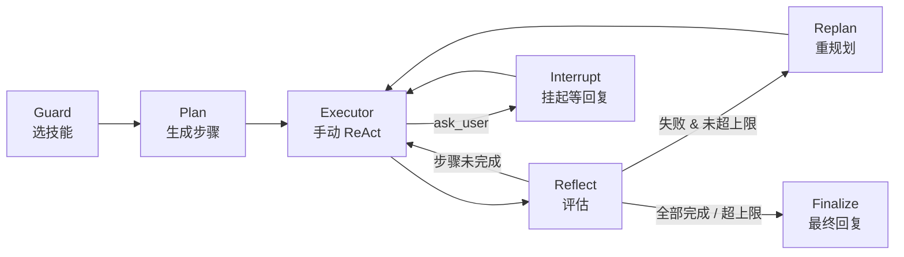

# i-member 系统设计

## 1. 概述与设计目标

i-member 是一个基于 LangGraph 的多 Agent 智能客服系统，面向品牌私域运营场景，覆盖工单办理、知识问答、商品推荐三类业务对话。

### 设计目标

- **多 Agent 协作**：将复杂客服流程拆分为多个专职 Agent，每个 Agent 负责有限的决策范围，避免单 Agent 上下文过载和决策漂移
- **品牌可插拔**：业务逻辑通过 Skill + Tools 两层抽象与框架分离。品牌接入只需提供提示词模板、技能文件、工具实现，无需修改核心流转逻辑
- **生产可靠性**：支持人工介入中断恢复、执行失败自动重规划、并发幂等控制、外部 API 限流保护
- **可评测**：建立从单元到全链路的评测体系，量化 Agent 行为，保障迭代不劣化

### 技术选型

| 组件 | 选型 |
|------|------|
| Agent 编排 | LangGraph |
| LLM | 支持任意 OpenAI 兼容接口（ChatOpenAI 适配器） |
| 本地模型 | Ollama（qwen2.5:7b，用于内部分类/压缩） |
| 状态持久化 | Redis（checkpoint + 缓存） |
| 向量检索 | Qdrant |
| PDF 解析 | LlamaParse |
| 可观测性 | Langfuse |

---

## 2. 系统架构

### 2.1 整体结构

系统由一个主图（Parent Graph）和三个子图（Subgraph）组成。主图负责路由决策和子图编排，子图各自封装完整的业务逻辑。每个子图通过 LangGraph 的 `add_subgraph` 机制挂载到主图，子图内部的状态变化对主图透明。


**状态管理**：主图和子图共享同一个 Redis checkpoint 实例（`AsyncRedisSaver`）。每次节点执行后 LangGraph 自动写入 checkpoint，包含当前图状态、消息历史和子图执行位置。恢复时从 checkpoint 重建完整执行上下文，无需手动持久化中间态。

**服务切换**：子图结束时设置 `current_subgraph = None`，下一轮用户消息自动进入 Router 重新判断意图。切换时调用 `get_service_clear_state()` 重置 19 个运行时字段，仅保留最后一轮用户+AI 对话作为过渡上下文。

### 2.2 主图路由

```
ENTRY → router_node → ticket_subgraph / qa_node / recommend_subgraph → post_process → END
```

**ENTRY 节点**检查 `current_subgraph` 字段，若已设置则跳过路由直接进入对应子图，否则进入 `router_node`。

**router_node** 是一次 LLM 结构化输出调用（`with_structured_output(RouterOutput)`），输出 `{intent: ticket|qa|recommend}`。Router 不挂载任何工具，仅做分类。

**子图完成后**返回主图，由 `post_process` 节点触发异步任务（写入服务记忆、提取用户事实）。

### 2.3 Ticket 子图

五节点 Plan-and-Execute 流水线，是系统最复杂的子图。



**Guard**：从已注册技能中匹配用户诉求。输入为 skill snapshot（精简 XML，仅含技能名、描述、可用工具列表），输出选中的技能名。使用本地 Ollama 模型以降低路由成本。

**Plan**：加载选中技能的完整 SKILL.md，基于处理原则和场景细分生成结构化步骤列表。每步包含 `goal`、`completion_signal`、`target_slots`、`available_tools`。最多生成 5 步，通常 3 步。

**Executor**：手动 ReAct 循环（非 LangGraph 内置 `create_react_agent`）。每一步按 `available_tools` 从全局工具注册表解析工具并绑定，额外附加 `ask_user` 和 `finish_step`。每次 LLM 调用强制 `tool_choice="required"`。工具调用次数接近上限时动态缩减可用工具至仅剩结束工具。所有工具调用记录写入 `try_process`（见 §5.2）。

**Reflect**：检查当前步骤的 `completion_signal` 是否达成、目标槽位是否填充。未完成则路由回 Executor；失败且未超 replan 上限则触发 Replan；全部完成或超限则进入 Finalize。

**Replan**：基于 Executor 产出的完整 `try_process` 重新调用 Planner，使新规划基于真实工具返回结果而非推测。最多 2 次。

**Finalize**：汇总所有步骤结果，生成用户可见的最终回复。同时将交互卡片数据写入 `service_state`，供前端渲染。

**Interrupt**：Executor 检测到 `ask_user` 调用后，路由到 `executor_interrupt_node` 调用 `graph_interrupt(payload)` 挂起。父图 checkpoint 覆盖中断点。用户回复后从 checkpoint 恢复，`executor_interrupt_node` 将回复写入 `try_process`，路由回 Executor 继续执行。

### 2.4 QA 子图

单节点 ReAct Agent。挂载 `rag_search` 和 `size_guide_search` 两个 RAG 检索工具，以及 `reply_to_user` 结束工具。系统提示词包含前置注入的品牌人设和用户画像。对话 token 超 `MAX_QA_TOKENS` 阈值时，调 `summary_agent.compress_qa()` 将历史压缩为摘要，state 替换为 `[摘要, 当前问题, AI 回复]`。

### 2.5 Recommend 子图

两阶段子图。Guard 节点负责跨轮上下文管理：将上一轮的 `recommend_context`（summary + anchor_products + cursor）与最新 trace 合并为新的摘要，存入 `state.service_state`。Agent 节点为 ReAct 循环，挂载 `search_products`、`get_product_detail`、`size_guide_search`、`reply_with_products`。多轮推荐上限 `RECOMMEND_MAX_ROUNDS`，超限自动结束。

### 2.6 模型路由

`get_llm(role)` 是唯一 LLM 入口。通过 `_ROLE_PROVIDER` 字典决定角色走 local 还是 remote。remote 使用 `ChatOpenAI` 适配器，支持任意 OpenAI 兼容接口（通过 `LLM_API_KEY`、`LLM_BASE_URL`、`LLM_MODEL` 三个环境变量配置）。local 使用 `ChatOllama`，当前仅 `summary` 角色使用，不配置 Ollama 时自动 fallback 到 remote。

---

## 3. 中断恢复

### 3.1 问题背景

LangGraph 子图中调用 `graph_interrupt` 后，中断点位于子图内部。如果使用 LangGraph 内置的 `create_react_agent`，中断发生在嵌套图的最深层，父图无法感知中断位置，resume 时 checkpoint 丢失。

本系统经历了三版迭代：

- **v1** — `create_react_agent` 默认配置：中断在子图的子图，父图看不到，无法恢复
- **v2** — 传递父图 checkpointer 给子图：`ainvoke` 独立运行，resume 时 checkpoint 被覆盖
- **v3** — 手动 ReAct 循环 + 独立 interrupt 节点：中断点提升到子图节点级别，父图 checkpoint 原生覆盖

### 3.2 最终方案

Ticket 子图的 Executor 不使用 LangGraph 内置的 `create_react_agent`，而是手写 ReAct 循环。工具调用和响应在循环内手动管理，ask_user 不触发 `graph_interrupt`，而是作为普通工具被检测到后路由到独立的 `executor_interrupt_node`。

**挂起流程**：

1. Executor 的 ReAct 循环中，LLM 返回的 tool_call 经检测确认为 ask_user
2. 将 ask_user 的调用参数写入 `try_process` 作为 `{tool: "ask_user", args: {...}}`
3. Executor 返回，路由函数检测到 try_process 末尾是未应答的 ask_user
4. 路由到 `executor_interrupt_node`，该节点调用 `graph_interrupt(payload)`
5. 此时中断发生在 ticket_subgraph 的节点层级，父图 checkpoint 原生覆盖中断点

**恢复流程**：

1. 用户回复传入，`executor_interrupt_node` 将回复作为 `{tool: "ask_user", result: "用户回复内容"}` 追加到 try_process
2. 路由回 Executor 继续执行当前步骤
3. Executor 从 try_process 还原之前的对话消息，LLM 在完整上下文中继续推理

### 3.3 关键设计决策

**不使用 ContextVar**：工具结果通过 module-level dict（key 为 thread_id）跨 task 传递。`asyncio.create_task` 创建的后台任务中 ContextVar 隔离，改用 module-level dict 保证 interrupt 恢复后工具结果仍然可见。

**单一 try_process 字段**：工具调用链、中断状态、压缩摘要、replan 回放全部共用同一字段，避免多套状态结构之间的同步泄露。格式统一为 `[{tool/args}, {tool/result}, ...]`，通过 `call_id` 精确配对同名工具的多次调用。

---

## 4. 上下文管理

### 4.1 差异化压缩策略

不同子图的对话模式不同，采用不同的上下文裁剪策略：

**Ticket 子图**：`try_process` 审计链压缩。单步骤内工具调用链超过 3000 token 阈值时触发，保留最近一对完整的 `{tool/args, tool/result}`，旧条目压缩为 `{compressed: "摘要"}`。压缩基于 `call_id` 配对，同名工具多次调用不会串位。

**QA 子图**：全文压缩。`qa_node` 在消息总 token 超过 `MAX_QA_TOKENS`(2000) 时，调用 `summary_agent.compress_qa()` 将全部历史压缩为一条摘要。State 替换为 `[摘要, 当前问题, AI 回复]`，上下文窗口从数十条消息降为 3 条。

**Recommend 子图**：两层压缩。Guard 层负责跨轮累计压缩——每轮进入时将上一轮的 `recommend_context`（summary + anchor_products + cursor）与最新轮 trace 合并，由 LLM 生成新的 `{summary, anchor_products, cursor}`。Agent 层负责窗口裁剪——ReAct 循环中仅保留最近 `RECOMMEND_MAX_TOOL_BLOCKS`(2) 个 AIMessage+ToolMessage 块。两层独立：Guard 保证跨轮信息不丢失，Agent 保证单轮内上下文不爆炸。

### 4.2 服务切换时的上下文处理

子图结束或 Router 检测到 QA→其他服务切换时，执行以下清理：

1. 调用 `get_service_clear_state()` 重置 19 个运行时字段
2. 调用 `extract_last_service_round()` 仅保留最后一轮用户+AI 文本消息
3. 触发 post-process 异步写入服务记忆和用户事实

新子图从干净状态启动，仅继承上一轮的人类可读对话，工具调用中间消息全部丢弃。

### 4.3 Token 估算

基于 `estimate_tokens(text)` 函数，采用 DeepSeek 官方换算公式（中文字符×0.6 + 英文字符×0.3）实时估算。统一用于 Executor 压缩、QA 压缩、RAG chunk 超长检测，各处阈值按场景独立配置。

### 4.4 Skill 渐进式披露

按流程阶段控制注入 LLM 的技能信息量，减小上下文窗口同时保证关键约束不丢失：

| 阶段 | 加载内容 | 用途 |
|------|---------|------|
| Guard | skill snapshot（XML 摘要） | 从已注册技能中选择匹配项 |
| Plan | 完整 SKILL.md | 生成结构化执行步骤 |
| Replan | SKILL.md 裁剪版（移除已传达的场景描述） | 基于失败上下文重新规划 |
| Execute | 仅当前步骤的 goal + available_tools | 单步执行，不加载完整技能文件 |

---

## 5. 记忆体系

系统维护三个独立的记忆层，各自承担不同职责，按需组合注入 prompt。

### 5.1 Service Memory

每次子图结束时异步写入 Redis list。记录 intent、thread_id、服务摘要和差异化 payload（Ticket 存 steps/slots，Recommend 存 trace，QA 存 null）。

- **写入**：`spawn_post_process_tasks()` → `summarize_service(messages, intent)` → Redis RPUSH + LTRIM（保留最近 10 条）+ EXPIRE 2 天
- **读取**：`get_service_memories_tool` 仅允许查询当前线程最近 5 条，user_id 和 thread_id 由 ContextVar 自动注入，不允许跨线程访问
- **落库**：DB INSERT + Redis 缓存（1h TTL）。读路径：LRANGE 命中返回 → miss 查 DB 回写 Redis

### 5.2 User Facts

对话结束后异步提取用户画像。`_apply_fact_changes()` 通过 casefold 去重 + 增量合并，支持 add 和 delete 双向操作，上限 8 条核心事实。

- **写入**：`extract_and_save_user_facts(messages)` → deepseek → Redis SET + EXPIRE 30 天
- **落库**：直写 DB + Redis 缓存（1h TTL）。读路径：Redis → miss → DB → 回写 Redis
- **触发**：每次服务结束后 + Router 检测到 QA→其他服务切换时

### 5.3 User Profile

通过 SCRM 查询用户档案（等级、消费额、偏好），交由 `summary_agent.summarize_profile()` 生成结构化摘要，Redis 缓存。

### 5.4 注入方式

三个数据源由 `load_user_context()` 统一组装后注入 prompt 前缀。Agent 不需要知道数据来源——Service Memory 回答"上次发生了什么"，User Facts 回答"用户是什么样的"，User Profile 回答"CRM 数据怎么说的"。

---

## 6. 工具系统

### 6.1 工具生命周期

业务工具统一通过 `get_scrm_tools()` 返回给框架。品牌接入时实现具体工具函数并注册到该方法中。

工具按绑定方式分为两类：

**步骤级绑定（Ticket）**：Executor 每步从 Skill 声明的 `available_tools` 中按名解析工具，叠加系统工具（`ask_user`、`finish_step`）后绑定。不同步骤看到的工具集不同。接近 tool call 上限时动态缩减至仅剩结束工具。

**ReAct 绑定（QA / Recommend）**：Agent 初始化时加载全部工具，通过 `_model_fn` 计数 ToolMessage，达到上限时替换为单一结束工具。

### 6.2 强制工具调用

所有 ReAct 循环统一使用 `tool_choice="required"`，LLM 必须在每次响应中调用至少一个工具。Router 和 Guard 不使用此策略（单次结构化输出）。

### 6.3 结束工具

`finish_step`、`reply_to_user`、`reply_with_products` 三个结束工具标记 `return_direct=True`，被调用时立即退出 ReAct 循环。`ask_user` 不是结束工具——它触发中断挂起，恢复后继续当前步骤。

### 6.4 工具描述规范

工具的 `description` 和参数的 `Field(description=...)` 直接决定 LLM 调用准确率。描述应明确：

- **使用场景**：什么时候该调这个工具
- **前置条件**：需要哪些数据已获取
- **返回值结构**：调用后会得到什么

---

## 7. 评测体系

### 7.1 三层金字塔

评测体系按覆盖范围和执行频率分为三层：

**单元测试**（6 模块）：纯函数断言，CodeGrader 检查确定性行为，秒级执行。每次 push 触发。

**Agent 单测**（37 case）：单 Agent 行为验证，CodeGrader 检查工具调用链、状态转换、槽位填充。直接调用 `agent.run()` 或 node 函数，无 LLM 依赖。每次 push 触发。

**E2E 全链路**（18 case）：HTTP API 入口，User Simulator 驱动完整对话，ModelGrader 三维加权评分（correctness×0.5 + groundedness×0.35 + card_usage×0.15），阈值 3.0/5。PR 和 merge main 时触发。

### 7.2 User Simulator

用户模拟器基于 Pydantic 结构化输出 `{message, should_end}`。第一版用文本 `[END]` 信号，LLM 无视导致告别循环（15 轮对话 10 轮告别）；第二版改为 `with_structured_output(SimulatorOutput)`，问题消失。

### 7.3 Case 生命周期

新 case 先在 capability 分组中验证，连续通过后移入 regression 纳入 CI 门禁。回归失败只修代码不改 case。

---

## 8. 可观测性与稳定性

### 8.1 Langfuse Trace

通过 `_enrich_config_with_langfuse()` 在每次 `wf.ainvoke` 前注入 callback handler。每个 HTTP 请求生成一条 trace，通过 `trace_name` + `langfuse_session_id`(=thread_id) + `langfuse_user_id` 串联多轮对话。E2E 测试通过 `channel:eval` tag 与正式请求区分。

LLM 调用通过 `invoke_with_usage_logging()` 记录结构化 JSON：node、provider、model、latency_ms、prompt_tokens、completion_tokens、success/error。

### 8.2 幂等性控制

Thread 级 Redis 分布式锁，防止前端网络抖动重试导致的状态竞争：

- **加锁**：`SET key owner NX EX 60` — 不存在才设，60s 过期，owner 为 UUID。未获取返回 HTTP 409
- **释放**：Lua 脚本原子校验 `if get(key) == owner then del(key)`
- **续期**：`asyncio.create_task` 每 30s 执行 Lua EXPIRE，进程正常退出时 cancel
- **兜底**：进程 crash 时 60s TTL 自动清理

### 8.3 接口限流

INCR 分钟桶模式，对 Onitsuka API 和 Mock SCRM 实现双级限流（单用户 + 全局）：

| 目标 | 单用户 | 全局 |
|------|--------|------|
| Onitsuka API | 10 req/min | 200 req/min |
| SCRM API | 30 req/min | 300 req/min |

超限直接拒绝（快失败），不重试。Counter 通过 `INCR + EXPIRE 90s` 实现滑动窗口。

### 8.4 LLM 超时降级

`BaseAgent.run()` 统一包装 `asyncio.wait_for(timeout)`，超时返回预设 fallback 话术。各 Agent timeout 按场景分级：Router 15s、Guard 30s、Executor 60s、Recommend 70s。

### 8.5 Checkpoint 容错

`create_checkpointer()` 优先 Redis `AsyncRedisSaver`（7 天 TTL），Redis 不可用时降级为 `MemorySaver`。service memory 和 user facts 在 Redis 不可用时记录 error 告警，不静默丢数据。

---

## 9. 结构化交互卡片

当 Executor 判断需要用户输入时，ask_user 不仅传递文字提示，还携带结构化的交互卡片。与常见做法不同，**卡片数据不在 LLM 上下文中拼装**——LLM 仅决定何时触发 ask_user 和展示什么文案，卡片所承载的订单、商品、工单等结构化实体通过独立数据通路传递。

### 9.1 两种卡片模式

- **select**：可点击选择卡片（订单列表、商品列表），`selectable=true`，用户点选代替打字，减少追问轮次
- **confirm**：纯展示确认卡片（工单创建确认），`selectable=false`，用户确认后流程继续

### 9.2 数据通路

卡片数据流不经过 LLM：

```
工具执行 → push_ticket_interaction_source(实体) → module-level dict[thread_id]
                                                       ↓
                                    ask_user → _normalize_interaction(dict) → InteractionPayload(JSON)
                                                       ↓
                                                  前端渲染卡片
```

1. SCRM/Onitsuka 工具执行完毕后，将返回的实体（订单、商品等）推送至 module-level dict，key 为 thread_id
2. Executor 检测到 ask_user 调用时，从 dict 中提取与该步骤相关的实体
3. `_normalize_interaction` 将实体标准化为 `InteractionPayload`（包含卡片类型、选项列表、默认值等）
4. `InteractionPayload` 随 ask_user 的 text 提示一起返回给前端
5. 前端根据 payload 渲染对应卡片，用户操作后结果返回

建单成功后自动嵌入工单确认卡片，与追问卡片走同一返回字段，前端无需为卡片类型做差异化处理。
